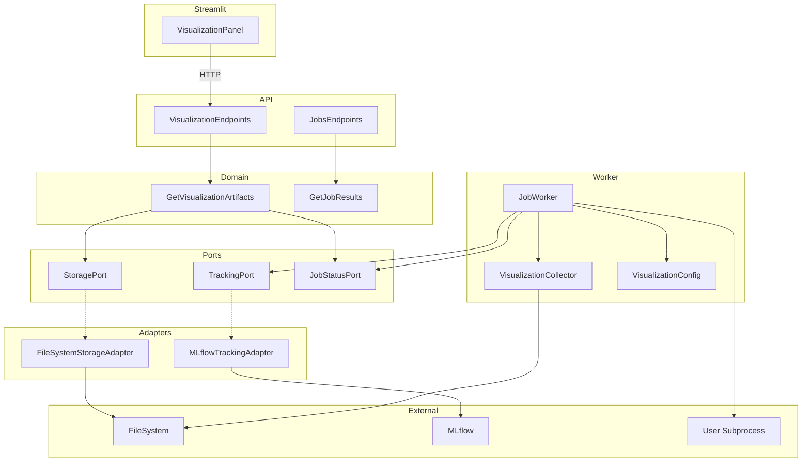
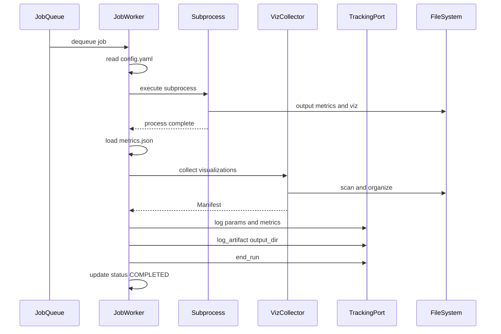
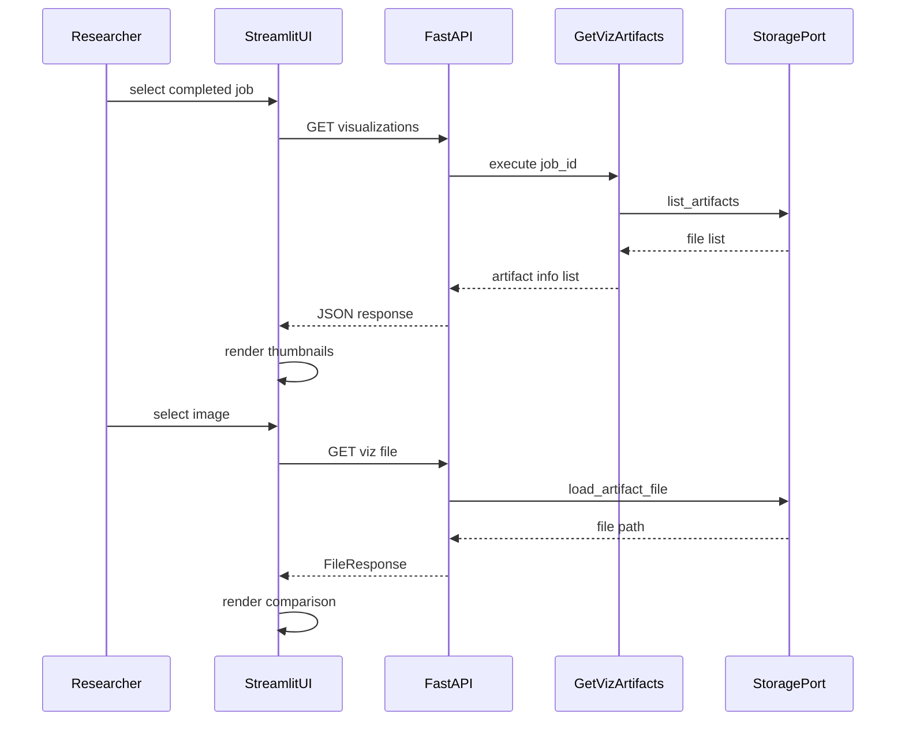
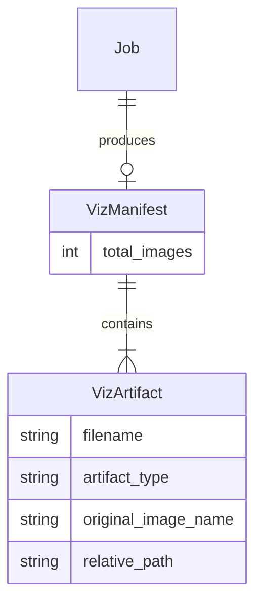

# 設計ドキュメント: 欠陥箇所の可視化機能

## Overview

本機能は、LeadersBoardプラットフォームにおいて
anomalibによる異常検知モデルの評価結果として
可視化アーティファクト（Anomaly Heatmap、
Segmentation Mask、Overlay Image）を
生成・保存・表示する機能を提供する。

**目的**: 研究者がモデルの欠陥検出結果を視覚的に
確認・比較し、半導体検査における品質管理・
原因分析に活用できるようにする。

**ユーザー**: 研究者がStreamlit UIおよびAPI経由で
可視化結果を閲覧・取得する。

**影響**: 既存のWorker評価パイプライン、API、
Streamlit UIに可視化アーティファクトの
収集・保存・表示機能を追加する。

### Goals

- Worker層で可視化アーティファクトの
  収集・整理・記録を自動化する
- 統一されたディレクトリ構造で
  可視化アーティファクトを管理する
- API経由での可視化アーティファクト
  一覧・取得を提供する
- Streamlit UIでの視覚的な
  欠陥箇所確認・比較機能を実現する
- 異常スコアのCSVデータ出力による
  定量分析を支援する

### Non-Goals

- 可視化パラメータ（カラーマップ等）の
  リアルタイム調整
- 動画形式の可視化出力
- 可視化結果に基づく自動判定・自動アラート
- 複数ジョブ間の可視化結果の
  統計的比較ダッシュボード
- Bounding Box形式の可視化
  （モデル依存であり標準化困難）

## Architecture

### Existing Architecture Analysis

本プラットフォームはヘキサゴナルアーキテクチャを
採用しており、以下の層構造で構成される。

- **Domain層** (`src/domain/`):
  ユースケース（CreateSubmission, EnqueueJob,
  GetJobStatus, GetJobResults）
- **Ports層** (`src/ports/`):
  抽象インターフェース（JobQueuePort,
  JobStatusPort, StoragePort, TrackingPort,
  RateLimitPort）
- **Adapters層** (`src/adapters/`):
  Redis、FileSystem、MLflowの具象実装
- **API層** (`src/api/`):
  FastAPIエンドポイント（jobs, submissions）
- **Worker層** (`src/worker/`):
  JobWorkerによるジョブ実行

依存方向:
`API/Worker → Domain → Ports ← Adapters`

現状の制約と拡張ポイント:

- Workerはサブプロセスでユーザーコードを実行し、
  `metrics.json` を読み取って
  `tracking.log_artifact(output_dir)` で
  MLflowに記録する。可視化アーティファクトも
  同じoutput_dir内に配置されれば
  MLflow記録は自動で行われる
- StoragePortは提出ファイル・ログの
  読み書きに特化しており、アーティファクトの
  個別アクセス機能がない
- APIはジョブのステータス・ログ・結果
  （MLflowリンク）を返すが、
  アーティファクト実体の配信機能がない
- Streamlit UIはジョブ一覧・ログ表示のみで、
  画像表示機能がない

### Architecture Pattern & Boundary Map



#### Architecture Integration

- 選択パターン:
  ヘキサゴナルアーキテクチャ（既存踏襲）
- ドメイン境界:
  Worker内部にVisualizationCollector/Configを
  配置。API側はStoragePort経由でアクセス
- 維持するパターン:
  Port/Adapter、FastAPI依存性注入、
  サブプロセス分離
- 新規コンポーネントの根拠:
  VisualizationCollector（Worker内部の収集）、
  GetVisualizationArtifacts（API用UC）、
  VisualizationEndpoints（REST API）、
  VisualizationPanel（UI表示）
- Steering準拠:
  ヘキサゴナルアーキテクチャの依存方向を維持。
  新規ポートの追加ではなく
  既存StoragePortの拡張で対応

### Technology Stack

|  Layer   |         Choice         |      Role      |
| -------- | ---------------------- | -------------- |
| Worker   | Python 3.13 + anomalib | 設定解析・収集 |
| API      | FastAPI + Pydantic     | エンドポイント |
| Storage  | FileSystem + MLflow    | 保存・記録     |
| Frontend | Streamlit              | 可視化UI       |

新規依存は不要。PyYAMLはanomalib経由で
Workerイメージに含まれる。

## System Flows

### 可視化アーティファクト生成・保存フロー



可視化収集でエラーが発生した場合、Workerは
エラーをログに記録し、メトリクス記録処理を
継続する（1.5）。

### 可視化結果取得・表示フロー



## Requirements Traceability

### Req 1: 可視化アーティファクト生成

| Req |   Summary   |  Component   |   Flow   |
| --- | ----------- | ------------ | -------- |
| 1.1 | Heatmap生成 | VizCollector | 生成保存 |
| 1.2 | Mask生成    | VizCollector | 生成保存 |
| 1.3 | Overlay生成 | VizCollector | 生成保存 |
| 1.4 | PNG形式     | VizCollector | 生成保存 |
| 1.5 | エラー継続  | JobWorker    | 生成保存 |

### Req 2: 可視化アーティファクト保存

| Req |  Summary   |  Component   |   Flow   |
| --- | ---------- | ------------ | -------- |
| 2.1 | Dir保存    | VizCollector | 生成保存 |
| 2.2 | MLflow記録 | JobWorker    | 生成保存 |
| 2.3 | 命名規則   | VizCollector | 生成保存 |
| 2.4 | 統一構造   | VizCollector | 生成保存 |

### Req 3: 可視化結果の表示

| Req |   Summary    | Component |   Flow   |
| --- | ------------ | --------- | -------- |
| 3.1 | サムネイル   | VizPanel  | 取得表示 |
| 3.2 | 拡大表示     | VizPanel  | 取得表示 |
| 3.3 | 比較Layout   | VizPanel  | 取得表示 |
| 3.4 | MLflowリンク | VizPanel  | 取得表示 |
| 3.5 | 結果なし表示 | VizPanel  | 取得表示 |

### Req 4: 可視化アーティファクト取得API

| Req |   Summary   |  Component   |   Flow   |
| --- | ----------- | ------------ | -------- |
| 4.1 | 一覧API     | VizEndpoints | 取得表示 |
| 4.2 | 画像取得API | VizEndpoints | 取得表示 |
| 4.3 | 404応答     | VizEndpoints | 取得表示 |
| 4.4 | 認証必須    | VizEndpoints | 取得表示 |

### Req 5: 異常スコアデータ出力

| Req | Summary  |  Component   |   Flow   |
| --- | -------- | ------------ | -------- |
| 5.1 | 画像CSV  | VizCollector | 生成保存 |
| 5.2 | PixelCSV | VizCollector | 生成保存 |
| 5.3 | CSV記録  | JobWorker    | 生成保存 |
| 5.4 | CSV DL   | VizEndpoints | 取得表示 |

### Req 6: 可視化設定

| Req |   Summary   | Component |   Flow   |
| --- | ----------- | --------- | -------- |
| 6.1 | Default有効 | VizConfig | 生成保存 |
| 6.2 | 無効化設定  | VizConfig | 生成保存 |
| 6.3 | 種別指定    | VizConfig | 生成保存 |
| 6.4 | 全種別      | VizConfig | 生成保存 |

## Components and Interfaces

### Component Summary

|    Component    |   Layer   |  Intent  |              Reqs              |
| --------------- | --------- | -------- | ------------------------------ |
| VizConfig       | Worker    | 設定解析 | 6.1-6.4                        |
| VizCollector    | Worker    | 収集整理 | 1.1-1.5, 2.1, 2.3-2.4, 5.1-5.2 |
| JobWorker拡張   | Worker    | 統合     | 1.5, 2.2, 5.3                  |
| StoragePort拡張 | Ports     | IF追加   | 4.1-4.2, 5.4                   |
| FSAdapter拡張   | Adapters  | 実装     | 4.1-4.2, 5.4                   |
| GetVizArtifacts | Domain    | UC       | 4.1, 4.3                       |
| VizEndpoints    | API       | REST     | 4.1-4.4, 5.4                   |
| VizPanel        | Streamlit | UI       | 3.1-3.5                        |

### Worker Layer

#### VisualizationConfig

|    Field     |              Detail               |
| ------------ | --------------------------------- |
| Intent       | config.yamlの可視化設定を解析する |
| Requirements | 6.1, 6.2, 6.3, 6.4                |

##### Responsibilities

- config.yamlから `visualization` セクションを
  読み取る
- デフォルト値を適用する
  （enabled=True, types=全種別）
- 不正な設定値を検出した場合は
  デフォルトにフォールバックする

##### Dependencies

- External: PyYAML — YAML解析
  (P2, anomalib経由で既存)

##### VizConfig Service Interface

```python
from dataclasses import dataclass
from enum import Enum
from pathlib import Path


class VisualizationType(str, Enum):
    ORIGINAL = "original"
    HEATMAP = "heatmap"
    MASK = "mask"
    OVERLAY = "overlay"


ALL_VIZ_TYPES: list[VisualizationType] = list(
    VisualizationType,
)


@dataclass(frozen=True)
class VisualizationConfig:
    enabled: bool = True
    types: tuple[VisualizationType, ...] = tuple(
        ALL_VIZ_TYPES,
    )

    @classmethod
    def from_config_file(
        cls,
        config_path: Path,
    ) -> "VisualizationConfig":
        """config.yamlからvisualization設定を
        読み取る。ファイルが存在しないまたは
        visualizationセクションがない場合は
        デフォルトを返す。
        """
        ...

    @classmethod
    def default(cls) -> "VisualizationConfig":
        """全種別有効のデフォルト設定を返す。"""
        ...
```

- Preconditions:
  config_pathが指すファイルはYAML形式
- Postconditions:
  有効なVisualizationConfigインスタンスを返却
- Invariants:
  enabledがFalseの場合、typesの内容に関わらず
  可視化はスキップされる

##### VizConfig Notes

- `visualization` セクションが存在しない場合は
  デフォルト（全種別有効）を返す (6.4)
- `visualization.enabled: false` の場合は
  全種別スキップ (6.2)
- `types` に不正な値が含まれる場合は
  ログ警告し、有効な値のみ使用

#### VisualizationCollector

|    Field     |                 Detail                 |
| ------------ | -------------------------------------- |
| Intent       | 出力ディレクトリから可視化を収集・整理 |
| Requirements | 1.1-1.5, 2.1, 2.3, 2.4, 5.1, 5.2       |

##### Collector Responsibilities

- 出力ディレクトリ内のPNG画像ファイルを
  再帰的に検出する
- ファイル名パターンに基づいて種別を分類する
  （`*_original.png`, `*_heatmap.png`,
  `*_mask.png`, `*_overlay.png`）
- 元画像（original）も収集対象に含め、
  比較ビュー (3.3) で利用可能にする
- `<output_dir>/visualizations/` に
  標準構造で配置する
- CSV予測ファイルの存在を確認し
  パスをマニフェストに記録する
  （`image_predictions.csv`,
  `pixel_predictions.csv`）
- マニフェスト（収集結果のサマリ）を生成する

##### Collector Dependencies

- Inbound: JobWorker — 収集呼び出し (P0)
- Inbound: VisualizationConfig — 種別フィルタ (P0)

##### VizCollector Service Interface

```python
from dataclasses import dataclass
from pathlib import Path


@dataclass(frozen=True)
class VisualizationArtifact:
    filename: str
    artifact_type: VisualizationType
    original_image_name: str
    relative_path: str


@dataclass(frozen=True)
class VisualizationManifest:
    artifacts: tuple[VisualizationArtifact, ...]
    csv_files: tuple[str, ...]
    total_images: int


class VisualizationCollector:
    def collect(
        self,
        output_dir: Path,
        config: VisualizationConfig,
    ) -> VisualizationManifest:
        """出力ディレクトリから可視化を収集する。

        Raises:
            VisualizationError: 収集中エラー
        """
        ...
```

- Preconditions:
  output_dirが存在し、サブプロセスが正常完了
- Postconditions:
  `output_dir/visualizations/` に標準構造で
  ファイルが配置される
- Invariants:
  元のファイルは削除せずコピーする。
  PNG形式のファイルのみ収集する

##### VizCollector Notes

- ファイル名規則:
  `{original_name}_{type}.png`
  （例: `000_heatmap.png`,
  `000_original.png`）(2.3)
- 元画像は `*_original.png` パターンで検出する。
  anomalibの出力に元画像が含まれない場合、
  テストデータセット内の対応ファイルを
  `visualizations/` にコピーして補完する
- `visualizations/` が既に標準構造の場合は
  再配置をスキップする
- anomalibのデフォルト出力
  （`images/` サブディレクトリ）からも検出する
- configのtypesに含まれない種別は
  収集対象外とする (6.3)。
  ただしoriginalはtypes設定に関わらず
  常に収集する（比較ビューの基準画像として必須）
- VisualizationErrorはカスタム例外クラスとして
  定義する

#### JobWorker Extended

|    Field     |            Detail            |
| ------------ | ---------------------------- |
| Intent       | ジョブ実行に可視化収集を追加 |
| Requirements | 1.5, 2.2, 5.3                |

##### JobWorker変更箇所

`execute_job()` メソッドのサブプロセス完了後・
メトリクス記録前に可視化収集ステップを挿入する。

```python
class JobWorker:
    def _collect_visualizations(
        self,
        output_dir: Path,
        config_path: Path,
    ) -> VisualizationManifest | None:
        """可視化アーティファクトを収集する。

        エラー時はログ記録してNoneを返す。
        メトリクス記録は継続する。
        """
        ...
```

- Preconditions: サブプロセスが正常完了
- Postconditions:
  成功時はManifestを返却。
  失敗時はNoneを返却しログに記録
- エラー時:
  `VisualizationError` をキャッチし、
  WARNINGレベルでログ出力。
  メトリクス記録処理は中断しない (1.5)

##### execute_job フロー変更

1. サブプロセス実行（既存）
2. metrics.json読み込み（既存）
3. 可視化アーティファクト収集（新規）
   — エラー時はスキップして継続
4. MLflow記録（既存 — output_dir全体を記録
   するため、visualizationsも含まれる）
5. ステータス更新（既存）

### Ports Layer

#### StoragePort Extended

|    Field     |              Detail              |
| ------------ | -------------------------------- |
| Intent       | アーティファクトアクセスIFを追加 |
| Requirements | 4.1, 4.2, 5.4                    |

##### StoragePort追加メソッド

```python
class StoragePort(ABC):
    @abstractmethod
    def list_artifacts(
        self,
        job_id: str,
        subdir: str = "visualizations",
    ) -> list[str]:
        """アーティファクトファイル名一覧。

        ディレクトリ未存在時は空リストを返す。
        ジョブ存在チェックはJobStatusPort側で
        行うため、本メソッドはFileNotFoundErrorを
        送出しない。

        Returns:
            ファイル名のリスト（空リスト可）
        """
        ...

    @abstractmethod
    def load_artifact_file(
        self,
        job_id: str,
        filepath: str,
    ) -> Path:
        """アーティファクトファイルの絶対パス。

        Raises:
            FileNotFoundError: 未存在時
            ValueError: パストラバーサル時
        """
        ...
```

### Adapters Layer

#### FileSystemStorageAdapter Extended

|    Field     |               Detail               |
| ------------ | ---------------------------------- |
| Intent       | FS上のアーティファクトアクセス実装 |
| Requirements | 4.1, 4.2, 5.4                      |

##### FSAdapter変更内容

- コンストラクタに
  `artifacts_root: Path | None` を追加
- デフォルト値は環境変数
  `ARTIFACT_ROOT`（`/shared/artifacts`）
- `list_artifacts`:
  `<artifacts_root>/<job_id>/<subdir>/` を
  スキャンしてファイル名リストを返却
- `load_artifact_file`:
  `<artifacts_root>/<job_id>/<filepath>` の
  絶対パスを返却。パストラバーサル防止付き

##### FSAdapter Notes

- パストラバーサル防止:
  `filepath` に `..` 含有または絶対パスの場合は
  `ValueError` を送出する
  （既存 `_validate_path` パターン踏襲）
- `list_artifacts` はディレクトリ未存在時に
  空リストを返却する
- ファイル未存在時は
  `FileNotFoundError` を送出する

### Domain Layer

#### GetVisualizationArtifacts

|    Field     |              Detail              |
| ------------ | -------------------------------- |
| Intent       | 可視化アーティファクト一覧取得UC |
| Requirements | 4.1, 4.3                         |

##### GetVizArtifacts Service Interface

```python
from dataclasses import dataclass


@dataclass(frozen=True)
class VisualizationArtifactInfo:
    filename: str
    artifact_type: str
    url: str


@dataclass(frozen=True)
class VisualizationResult:
    artifacts: list[VisualizationArtifactInfo]
    csv_files: list[str]


class GetVisualizationArtifacts:
    def __init__(
        self,
        storage: StoragePort,
        status: JobStatusPort,
    ) -> None:
        ...

    def execute(
        self,
        job_id: str,
    ) -> VisualizationResult:
        """可視化アーティファクト一覧を返す。

        1. JobStatusPort経由でジョブ完了を確認
        2. list_artifacts(job_id, "visualizations")
           で画像一覧を取得
        3. list_artifacts(job_id, "") で
           ルート直下のCSVファイルを検出
        4. VisualizationResultにまとめて返却

        ジョブ未完了時は空のResultを返す。
        """
        ...
```

- Preconditions: job_idが有効な文字列
- Postconditions:
  ジョブ完了かつアーティファクト存在時は
  リスト返却。それ以外は空Result

##### GetVizArtifacts Dependencies

- Inbound: VizEndpoints — API経由呼び出し (P0)
- Outbound: StoragePort — 一覧取得 (P0)
- Outbound: JobStatusPort — 完了確認 (P0)

### API Layer

#### VisualizationEndpoints

|    Field     |          Detail          |
| ------------ | ------------------------ |
| Intent       | 可視化RESTエンドポイント |
| Requirements | 4.1, 4.2, 4.3, 4.4, 5.4  |

##### VizEndpoints API Contract

| Method |             Endpoint             | Response |
| ------ | -------------------------------- | -------- |
| GET    | /jobs/{id}/visualizations        | JSON一覧 |
| GET    | /jobs/{id}/visualizations/{file} | File     |

##### VizEndpoints Response Models

```python
from pydantic import BaseModel


class VizArtifactResponse(BaseModel):
    filename: str
    artifact_type: str
    url: str


class VizListResponse(BaseModel):
    job_id: str
    artifacts: list[VizArtifactResponse]
    csv_files: list[str]
```

##### VizEndpoints Notes

- 全エンドポイントに
  `Depends(get_current_user)` で
  Bearer token認証を適用する (4.4)
- アーティファクト一覧が空の場合は
  空リストを返却する（404ではない）
- ジョブID未存在時は404を返却する (4.3)
- ファイル未存在時は404を返却する (4.3)
- 一覧APIのレスポンス `VizListResponse` の
  `csv_files` フィールドは
  `GetVisualizationArtifacts` が
  `list_artifacts(job_id, "")` で取得した
  ルート直下のCSVファイル名を格納する
- CSVファイルは
  `GET /jobs/{id}/visualizations/{file}` で
  取得する。`load_artifact_file` は
  `visualizations/` サブディレクトリだけでなく
  ジョブルート直下のファイルも対象とする (5.4)
- `FileResponse` で
  `Content-Disposition` を設定する
- 既存 `jobs.py` への追加または
  新規 `visualizations.py` として分離するかは
  実装時に判断する

### Streamlit Layer

#### VisualizationPanel

|    Field     |         Detail          |
| ------------ | ----------------------- |
| Intent       | 可視化結果の表示UI      |
| Requirements | 3.1, 3.2, 3.3, 3.4, 3.5 |

##### VizPanel Responsibilities

- 完了済みジョブのexpander内に
  可視化セクションを表示する
- API経由で可視化アーティファクト一覧を取得し、
  サムネイルグリッドを描画する (3.1)
- サムネイル選択時に拡大表示する (3.2)
- 元画像・ヒートマップ・マスク・オーバーレイの
  4列比較レイアウトを提供する (3.3)
- MLflow UIアーティファクトページへの
  リンクを表示する (3.4)
- アーティファクト不在時は
  「可視化結果なし」メッセージを表示する (3.5)

##### VizPanel Dependencies

- Outbound: VizEndpoints —
  一覧・画像取得 (P0)
- External: Streamlit — UI描画
  (P0, 既存依存)

##### VizPanel Notes

- `st.columns(4)` で4列レイアウト
  （Original / Heatmap / Mask / Overlay）
- `st.image` でサムネイル・拡大画像を表示。
  API経由で取得した画像バイト列を使用
- `st.expander("可視化結果")` で折りたたみ。
  完了済みジョブのみ表示
- `st.selectbox` で対象画像を選択し、
  比較ビューを描画
- MLflowリンクは既存の
  `build_mlflow_run_link` を拡張し、
  アーティファクトページパスを含める (3.4)
- 画像取得にはAPI Tokenが必要。
  `st.session_state` から取得

## Data Models

### Domain Model

可視化アーティファクトはJob集約に属する
値オブジェクトとして扱う。
独立したデータベースエンティティは導入しない。



### File System Data Model

可視化アーティファクトの保存構造:

```text
<artifact_root>/
  <job_id>/
    metrics.json
    visualizations/
      <image_name>_original.png
      <image_name>_heatmap.png
      <image_name>_mask.png
      <image_name>_overlay.png
    image_predictions.csv
    pixel_predictions.csv
```

### Data Contracts

#### image_predictions.csv

|    Column     |  Type  |  Description   |
| ------------- | ------ | -------------- |
| image_path    | string | テスト画像パス |
| anomaly_score | float  | 異常スコア     |
| pred_label    | string | 判定結果       |

#### pixel_predictions.csv

|      Column      |  Type  |  Description   |
| ---------------- | ------ | -------------- |
| image_path       | string | テスト画像パス |
| height           | int    | 画像高さ(px)   |
| width            | int    | 画像幅(px)     |
| anomaly_map_path | string | 異常マップパス |

#### config.yaml visualization section

```yaml
visualization:
  enabled: true
  types:
    - heatmap
    - mask
    - overlay
```

|  Field  | Type | Default | Description |
| ------- | ---- | ------- | ----------- |
| enabled | bool | true    | 有効・無効  |
| types   | list | all     | 可視化種別  |

## Error Handling

### Error Strategy

可視化処理のエラーはメトリクス記録処理を
ブロックしない（グレースフルデグラデーション）。
Worker内部でVisualizationErrorをキャッチし、
ログ記録のみ行う。

### Worker Errors

|        Error         | Severity |     Response     |
| -------------------- | -------- | ---------------- |
| 可視化ファイル未検出 | WARNING  | ログ記録。継続   |
| config.yaml解析失敗  | WARNING  | デフォルトで継続 |
| ファイルコピー失敗   | ERROR    | ログ記録。継続   |
| ディスク容量不足     | ERROR    | ログ記録。継続   |

### API Errors

|         Error          | Code |     Response      |
| ---------------------- | ---- | ----------------- |
| ジョブID未存在         | 404  | Job not found     |
| アーティファクト未存在 | 404  | Not found         |
| ファイル未存在         | 404  | File not found    |
| 認証失敗               | 401  | Not authenticated |
| パストラバーサル       | 400  | Invalid path      |

### Monitoring

- Worker: 可視化収集の成功・失敗・スキップを
  INFO/WARNINGレベルでログ出力
- API: HTTPステータスを
  標準アクセスログで記録
- 既存のMLflowアーティファクト記録ログを活用

## Testing Strategy

### Unit Tests

- VisualizationConfig:
  YAML解析（正常系・セクション欠落・不正値）、
  デフォルト値適用、enabledフラグ判定
- VisualizationCollector:
  ファイル検出（再帰スキャン）、種別分類、
  マニフェスト生成、空ディレクトリ処理
- GetVisualizationArtifacts:
  正常系、アーティファクト不在時の空リスト、
  ジョブ未完了時の空リスト
- Pydanticモデル:
  VizListResponse / VizArtifactResponseの
  シリアライズ

### Integration Tests

- JobWorker拡張:
  可視化収集ステップの統合テスト。
  成功ケース・エラー時の継続動作
- StoragePort拡張:
  list_artifacts / load_artifact_fileの
  実ファイルシステムテスト。
  パストラバーサル防止
- APIエンドポイント:
  認証・レスポンス形式・404ハンドリング・
  FileResponse

### E2E Tests

- ジョブ実行→可視化収集→API取得→UI表示の
  完全フロー
- 可視化無効設定でのジョブ実行
  （アーティファクト生成なし確認）
- 可視化アーティファクト不在時のUIハンドリング
  （「可視化結果なし」表示）

## Security Considerations

- 可視化エンドポイントは既存の認証機構
  （Bearer token + `get_current_user`）を
  再利用する (4.4)
- `load_artifact_file` で
  パストラバーサル防止を実装する
  （`..` 含有・絶対パス拒否。
  既存 `_validate_path` パターン踏襲）
- ファイル名のサニタイズ:
  英数字・ハイフン・アンダースコア・ドット・
  スラッシュ以外を拒否

## Performance and Scalability

- 可視化画像はPNG形式で保存する。
  テスト画像数に比例してディスク使用量が増加する。
  可視化無効化設定 (6.2) で制御可能
- API経由の画像取得は `FileResponse` を使用し、
  ストリーミング配信でメモリ効率を確保する
- Streamlit UIでのサムネイル表示は
  API経由で画像を取得するため、
  大量画像時は遅延読み込みを検討する
- MLflowへのアーティファクト記録は既存の
  `log_artifact(output_dir)` を活用する。
  visualizationsサブディレクトリも含めて
  一括記録されるため、
  追加のMLflow APIコールは不要
