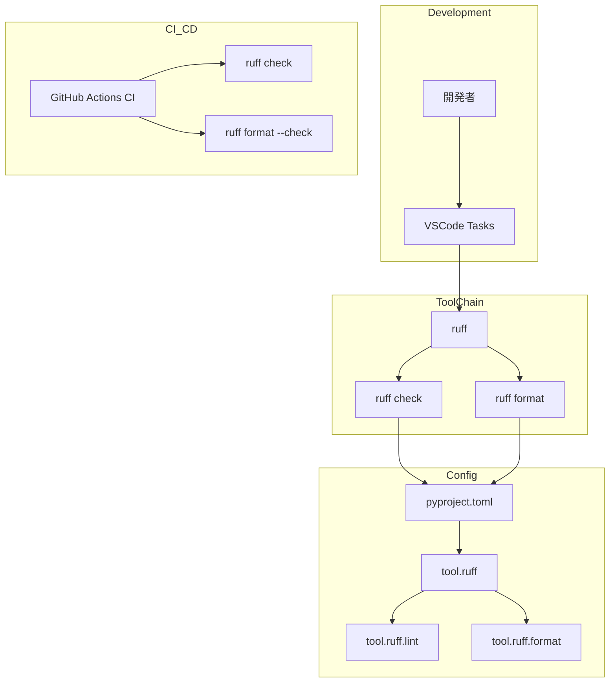

# Design Document: Formatter Migration to Ruff

## Overview

**Purpose**: Pythonコードフォーマッターをblackからruffへ移行し、ツールチェーンを簡素化する。

**Users**: 開発者、CI/CD管理者がruff単体でリント・フォーマット・インポートソートを実行できるようになる。

**Impact**: 現在のblack/isort依存を削除し、ruff formatに統合。CI/CDパイプラインと開発ワークフローを更新。

### Goals

- blackと同等のフォーマット品質をruffで維持
- ツールチェーンの簡素化（black + isort → ruff）
- CI/CD実行時間の短縮
- 開発者体験の向上（単一ツールでリント・フォーマット・インポートソート）

### Non-Goals

- フォーマットスタイルの変更（既存スタイルを維持）
- 新しいリントルールの追加
- pre-commit設定の新規作成（既存設定がある場合のみ更新）

## Architecture

### Existing Architecture Analysis

現在のコード品質ツール構成:

- **Linter**: ruff（既に導入済み、`[tool.ruff.lint]`設定あり）
- **Formatter**: black（`[tool.black]`設定あり）
- **Import Sorter**: isort（`[tool.isort]`設定あり、ruffでも`I`ルール有効化済み）

問題点:

- blackとisortが依存関係として残存
- CI/CDでフォーマットチェックが未実施
- VSCodeタスクがlintのみでformat未対応
- ドキュメントがblack/isortを参照

### Architecture Pattern & Boundary Map



Architecture Integration:

- Selected pattern: 単一ツール統合（ruffにlint/format/isortを集約）
- Domain boundaries: 設定は`pyproject.toml`に集約、実行はCLI経由
- Existing patterns preserved: ruff lint設定（`[tool.ruff.lint]`）は維持
- New components rationale: `[tool.ruff.format]`セクションを追加
- Steering compliance: Python 3.13対応、line-length=100維持

### Technology Stack

| Layer         | Choice           | Role                   | Notes              |
| ------------- | ---------------- | ---------------------- | ------------------ |
| CLI Tool      | ruff >=0.8.0     | リント/フォーマット    | 既存依存を継続     |
| Configuration | pyproject.toml   | ツール設定の集約       | format設定を追加   |
| CI/CD         | GitHub Actions   | 品質ゲート             | format checkを追加 |
| IDE           | VSCode Tasks     | 開発ワークフロー       | タスク定義を更新   |

## Requirements Traceability

| Requirement | Summary              | Components       | Interfaces     |
| ----------- | -------------------- | ---------------- | -------------- |
| 1.1-1.5     | Ruffフォーマッター   | pyproject.toml   | CLI            |
| 2.1-2.4     | インポートソート     | pyproject.toml   | CLI            |
| 3.1-3.4     | CI/CDパイプライン    | ci.yml           | GitHub Actions |
| 4.1-4.5     | 開発ワークフロー     | tasks.json       | VSCode         |
| 5.1-5.3     | ドキュメント更新     | tech.md          | -              |
| 6.1-6.5     | 依存関係整理         | requirements-dev | -              |

## Components and Interfaces

コンポーネント概要:

- **pyproject.toml**: ruff format設定の定義（Req: 1.1-1.5, 2.1-2.4, 6.4-6.5）
- **ci.yml**: フォーマットチェックの実行（Req: 3.1-3.4）
- **tasks.json**: VSCodeタスク定義（Req: 4.1-4.4）
- **requirements-dev.txt**: 開発依存の管理（Req: 6.1-6.3）
- **tech.md**: 技術ドキュメント（Req: 5.1-5.2）

### Configuration Layer

#### pyproject.toml

- **Intent**: ruff formatの設定を定義し、black/isort設定を削除
- **Requirements**: 1.1, 1.2, 2.3, 6.4, 6.5

##### pyproject.toml Responsibilities

- `[tool.ruff.format]`セクションでフォーマット設定を定義
- `[tool.black]`セクションを削除
- `[tool.isort]`セクションを削除（`[tool.ruff.lint.isort]`で代替済み）

##### pyproject.toml Configuration Changes

追加:

```toml
[tool.ruff.format]
quote-style = "double"
indent-style = "space"
skip-magic-trailing-comma = false
line-ending = "auto"
```

削除:

```toml
# 以下を削除
[tool.black]
target-version = ["py313"]
line-length = 100

[tool.isort]
profile = "black"
line_length = 100
known_first_party = ["src"]
```

##### pyproject.toml Notes

- Integration: 既存の`[tool.ruff]`セクションと統合
- Validation: `ruff format --check .`で設定の妥当性を確認
- Risks: なし（デフォルト設定がblack互換）

### CI/CD Layer

#### ci.yml

- **Intent**: CIパイプラインにフォーマットチェックを追加
- **Requirements**: 3.1, 3.2, 3.3, 3.4

##### ci.yml Responsibilities

- `ruff check .`の後に`ruff format --check .`を実行
- フォーマット違反時は非ゼロ終了コードでビルドを失敗させる

##### ci.yml Pipeline Changes

```yaml
- name: Run ruff
  run: |
    cd LeadersBoard
    ruff check .
    ruff format --check .
```

##### ci.yml Notes

- Integration: 既存のruff checkステップを拡張
- Validation: PR作成時に自動実行
- Risks: 移行直後は多数のフォーマット違反が検出される可能性

### IDE Layer

#### tasks.json

- **Intent**: VSCodeタスクでlintとformatを両方実行
- **Requirements**: 4.3, 4.4

##### tasks.json Responsibilities

- 「Ruff Check」タスク: `ruff check`と`ruff format --check`を実行
- 「Ruff Fix」タスク: `ruff check --fix`と`ruff format`を実行

##### tasks.json Task Changes

```json
{
  "label": "Ruff Check",
  "type": "shell",
  "command": "cd LeadersBoard && ruff check . && ruff format --check .",
  "problemMatcher": []
},
{
  "label": "Ruff Fix",
  "type": "shell",
  "command": "cd LeadersBoard && ruff check --fix . && ruff format .",
  "problemMatcher": []
}
```

##### tasks.json Notes

- Integration: 既存タスクのコマンドを更新
- Validation: タスク実行で動作確認
- Risks: なし

### Dependencies Layer

#### requirements-dev.txt

- **Intent**: 不要なフォーマッター依存を削除
- **Requirements**: 6.1, 6.2, 6.3

##### requirements-dev.txt Responsibilities

- `black>=24.10.0`を削除
- `isort>=5.13.0`を削除
- `ruff>=0.8.0`は維持

##### requirements-dev.txt Dependency Changes

削除:

```text
black>=24.10.0
isort>=5.13.0
```

##### requirements-dev.txt Notes

- Integration: 依存関係の削減
- Validation: `pip install -r requirements-dev.txt`で確認
- Risks: なし（ruffで完全に代替）

### Documentation Layer

#### tech.md

- **Intent**: 技術ドキュメントのFormatter記述を更新
- **Requirements**: 5.1, 5.2

##### tech.md Responsibilities

- Code QualityセクションのFormatter記述を更新
- Common Commandsセクションのコマンドを更新

##### tech.md Documentation Changes

Code Quality:

```markdown
### Code Quality

- **Linter**: `ruff`
- **Formatter**: `ruff format`
- **Import Order**: `ruff`（`I`ルール）
```

Common Commands:

```bash
# Lint: ruff check .
# Format: ruff format .
# Fix: ruff check --fix . && ruff format .
```

## Testing Strategy

### Unit Tests

- pyproject.toml設定の構文検証: `ruff check --config pyproject.toml`
- フォーマット設定の動作確認: `ruff format --check .`

### Integration Tests

- CI/CDパイプラインの動作確認: GitHub Actionsのテスト実行
- VSCodeタスクの動作確認: タスク実行による手動検証

### E2E Tests

- 全ファイルのフォーマット適用: `ruff format .`実行後の差分確認
- 既存コードスタイルとの一貫性確認: PR作成時のレビュー

## Migration Strategy


### Phase 1: 設定追加

- `pyproject.toml`に`[tool.ruff.format]`を追加
- `[tool.black]`と`[tool.isort]`を削除

### Phase 2: 全ファイルフォーマット

- `ruff format .`で全Pythonファイルを再フォーマット
- 差分を確認し、コミット

### Phase 3: CI更新

- `ci.yml`に`ruff format --check .`を追加
- `tasks.json`のタスクを更新

### Phase 4: ドキュメント更新

- `tech.md`のCode Quality/Common Commandsセクションを更新

### Phase 5: 依存削除

- `requirements-dev.txt`からblack/isortを削除

### Rollback Triggers

- フォーマット結果がblackと大きく異なる場合
- CI/CDパイプラインが予期せず失敗する場合
- 開発者から重大な問題報告がある場合

### Validation Checkpoints

- 各フェーズ完了後に`ruff format --check .`で検証
- PR作成時にCIが通ることを確認
