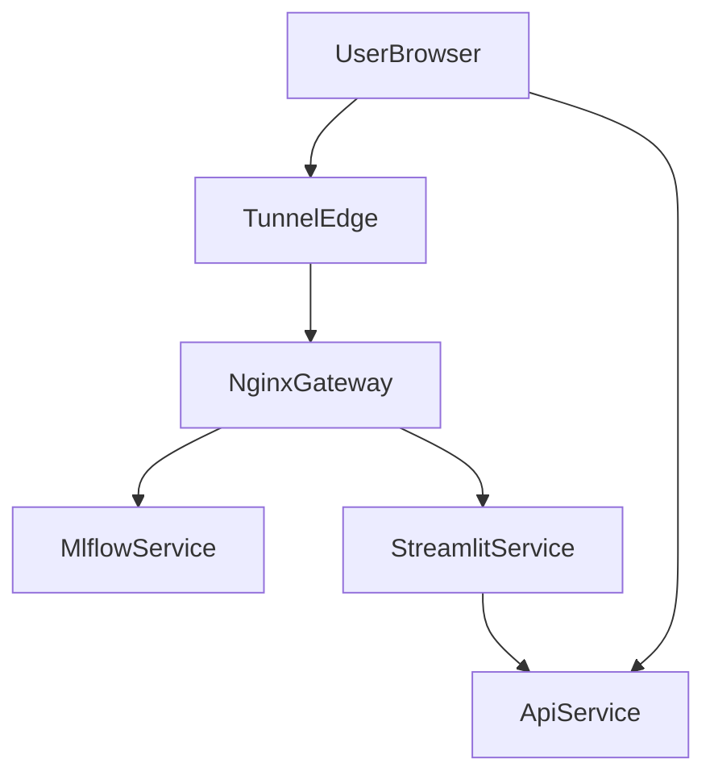
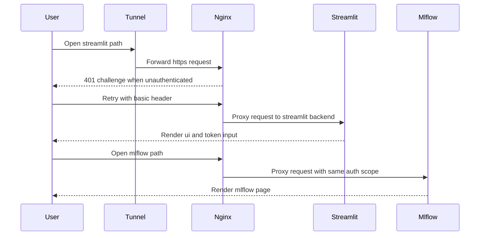

# Design Document

## Overview

本機能は、LeadersBoard の公開経路に Nginx リバースプロキシを追加し、
同一ホスト配下の `/mlflow/` と `/streamlit/` を Basic 認証で保護する。
これにより、MLflow と Streamlit の直接公開を停止し、外部公開面を
単一入口に集約する。

FastAPI は既存の Bearer トークン認証を持つため、公開ポート `8010` を
維持し Nginx 保護対象外とする。Streamlit では既存トークン入力フローを
維持し、入口認証とアプリ内認可の二層構成を継続する。
Basic 認証はブラウザから Nginx へ到達する入口で ID/Password を確認する仕組みで、
Bearer トークン認証は Streamlit から API を呼ぶ際の操作権限を確認する仕組みである。

### Goals

- Nginx を導入し、`mlflow` と `streamlit` の直接公開を停止する。
- `/mlflow/` と `/streamlit/` のパス分割を同一ホストで提供する。
- Basic 認証と既存 Streamlit トークン入力を併用する。
- devcontainer と本番デプロイ互換性を維持する。

### Non-Goals

- FastAPI 認証方式の変更。
- Cloudflare Access など外部認証基盤への置換。
- MLflow と Streamlit の機能追加。

## Architecture

### Existing Architecture Analysis

- `LeadersBoard/docker-compose.yml` は `mlflow:5010` と `streamlit:8501` を
  `ports` で公開している。
- `api:8010` は Bearer トークン認証を実装済みである。
- Streamlit は `MLFLOW_URL` を使って run リンクを生成している。

### Architecture Pattern & Boundary Map



- Selected pattern: path based reverse proxy
- Domain boundaries:
  - 入口認証と経路制御は Nginx が担当する。
  - アプリ内認可は Streamlit と API が担当する。
  - MLflow と Streamlit は内部ネットワーク公開に限定する。
- Existing patterns preserved:
  - API の Bearer 認証と既存ドメイン責務を維持する。

### Technology Stack

| Layer                   | Choice                    | Role                                  |
| ----------------------- | ------------------------- | ------------------------------------- |
| Infrastructure runtime  | Nginx 1.27-alpine         | Basic 認証、パスルーティング、WS 中継 |
| Edge ingress            | cloudflared tunnel        | HTTPS 終端と外部公開                  |
| UI runtime              | Streamlit                 | `/streamlit/` 配下 UI 提供            |
| Tracking runtime        | MLflow server             | `/mlflow/` 配下 UI と API 提供        |
| Credentials             | htpasswd file             | Basic 認証の ID と Password 管理      |

## System Flows



- Basic 認証は入口で必須化する。
- Streamlit のトークン入力は認可として継続する。
- Streamlit のリアルタイム更新のため WebSocket を中継する。

## Requirements Traceability

- `1.1`: ComposeTopologyManager が Nginx サービス追加を定義する。
- `1.2`: NginxGatewayConfig が外部公開ポート受信を定義する。
- `1.3`: NginxGatewayConfig が `/mlflow/` と `/streamlit/` の経路を定義する。
- `1.4`: ComposeTopologyManager が MLflow の `expose` 限定を定義する。
- `1.5`: ComposeTopologyManager が Streamlit の `expose` 限定を定義する。
- `1.6`: ComposeTopologyManager が API 公開維持を定義する。
- `2.1`: NginxGatewayConfig が未認証時 401 を返す。
- `2.2`: NginxGatewayConfig が認証後 MLflow 転送を行う。
- `2.3`: AuthCredentialManager が `htpasswd` を管理する。
- `2.4`: NginxGatewayConfig が MLflow 全パス保護を行う。
- `2.5`: NginxGatewayConfig が Forwarded ヘッダーを転送する。
- `2.6`: MlflowPathAdapterConfig がサブパス動作を定義する。
- `3.1`: NginxGatewayConfig が Streamlit 未認証 401 を返す。
- `3.2`: NginxGatewayConfig が Streamlit 認証後転送を行う。
- `3.3`: AuthCredentialManager が認証ファイル共有を定義する。
- `3.4`: StreamlitPathAdapterConfig が WebSocket 転送を定義する。
- `3.5`: StreamlitPathAdapterConfig が既存トークンフロー維持を定義する。
- `3.6`: AuthBoundaryPolicy が二層認証境界を定義する。
- `3.7`: StreamlitPathAdapterConfig が `/streamlit/` サブパス対応を定義する。
- `4.1`: AuthCredentialManager が `htpasswd` の Git 管理外運用を定義する。
- `4.2`: AuthCredentialManager が `.env.example` 手順整備を定義する。
- `4.3`: AuthCredentialManager が代替生成手順を定義する。
- `4.4`: NginxGatewayConfig が認証ファイル欠如時の起動失敗を定義する。
- `5.1`: ComposeTopologyManager が devcontainer 互換を定義する。
- `5.2`: DeployPipelineBinding が prod compose への Nginx 組み込みを定義する。
- `5.3`: DeployPipelineBinding が deploy workflow 互換を定義する。
- `5.4`: NginxGatewayConfig が `nginx/` 配下への設定集約を定義する。
- `5.5`: ComposeTopologyManager が開発アクセス互換を定義する。
- `5.6`: TunnelIngressPolicy が cloudflared HTTPS 整合を定義する。
- `6.1`: NginxGatewayConfig が `client_max_body_size` を定義する。
- `6.2`: NginxGatewayConfig が proxy timeout を定義する。
- `6.3`: NginxGatewayConfig が標準出力ログを定義する。
- `6.4`: ComposeTopologyManager が `restart` 方針を定義する。

## Components and Interfaces

### Component Summary

- ComposeTopologyManager:
  - Domain: Infra compose
  - Requirements: 1.1, 1.4, 1.5, 1.6, 5.1, 5.5, 6.4
- NginxGatewayConfig:
  - Domain: Infra proxy
  - Requirements: 1.2, 1.3, 2.1-2.2, 2.4-2.5, 3.1-3.2, 4.4, 5.4, 6.1-6.3
- StreamlitPathAdapterConfig:
  - Domain: App edge
  - Requirements: 3.4, 3.5, 3.7
- MlflowPathAdapterConfig:
  - Domain: App edge
  - Requirements: 2.6
- AuthCredentialManager:
  - Domain: Security ops
  - Requirements: 2.3, 3.3, 4.1-4.3
- AuthBoundaryPolicy:
  - Domain: Security policy
  - Requirements: 3.6
- TunnelIngressPolicy:
  - Domain: Edge policy
  - Requirements: 5.6
- DeployPipelineBinding:
  - Domain: CI CD ops
  - Requirements: 5.2, 5.3

### Infra Layer

#### ComposeTopologyManager

- Intent:
  - docker-compose の公開境界を再定義する。
- Responsibilities:
  - Nginx を追加し、`mlflow` と `streamlit` を内部公開へ移行する。
  - `api:8010` の既存公開を維持する。
- Dependencies:
  - Inbound: 運用者の compose 実行。
  - Outbound: compose ファイル群。

```python
from typing import Protocol

class ComposeTopologyContract(Protocol):
    def validate_public_ports(self) -> list[str]: ...
    def validate_internal_exposure(self) -> list[str]: ...
```

#### NginxGatewayConfig

- Intent:
  - Basic 認証とパスルーティングを一元管理する。
- Responsibilities:
  - `/mlflow/` と `/streamlit/` の双方に `auth_basic` を適用する。
  - `Host`、`X-Real-IP`、`X-Forwarded-For`、`X-Forwarded-Proto` を転送する。
  - `client_max_body_size` と proxy timeout を設定する。
  - access/error ログを標準出力へ出す。
- Dependencies:
  - Inbound: cloudflared からの公開リクエスト。
  - Outbound: `mlflow:5010` と `streamlit:8501`。

```python
from typing import Protocol

class ProxyRoutingContract(Protocol):
    def route_mlflow(self, request_path: str) -> str: ...
    def route_streamlit(self, request_path: str) -> str: ...
```

### Application Edge Layer

#### StreamlitPathAdapterConfig

- Intent:
  - Streamlit を `/streamlit/` 配下で安定動作させる。
- Responsibilities:
  - `server.baseUrlPath` を設定する。
  - WebSocket 経路の Upgrade ヘッダー転送を定義する。
  - 既存トークン入力フローを維持する。

```python
from typing import Protocol

class StreamlitAuthBoundaryContract(Protocol):
    def preserve_token_flow(self) -> bool: ...
    def validate_base_path(self) -> bool: ...
```

#### MlflowPathAdapterConfig

- Intent:
  - MLflow を `/mlflow/` 配下で動作させる。
- Responsibilities:
  - Nginx rewrite と MLflow 側設定の境界を明確化する。
  - UI と API の疎通が両立する設定を定義する。
  - 公開パス契約を次の通り固定する。
    - Public: `/mlflow/`
    - Upstream: `http://mlflow:5010/`
    - Nginx: `location /mlflow/` + `proxy_pass http://mlflow:5010/`
    - Rewrite: `^/mlflow/(.*)$ -> /$1`
  - 検証対象エンドポイントを次の通り固定する。
    - UI root: `/mlflow/`
    - UI run page: `/mlflow/#/experiments/1/runs/{run_id}`
    - API sample: `/mlflow/api/2.0/mlflow/experiments/list`

```python
from typing import Protocol

class MlflowPathContract(Protocol):
    def map_public_path(self, public_path: str) -> str: ...
    def validate_required_endpoints(self) -> list[str]: ...
```

### Security and Operations Layer

#### AuthCredentialManager

- Intent:
  - `htpasswd` の生成、共有、保護運用を標準化する。
- Responsibilities:
  - Git 管理外運用を強制する。
  - `htpasswd` と Docker 代替手順を文書化する。
  - `htpasswd` 不在時に fail-fast で起動失敗させる。
  - 起動時検証契約を次の通り固定する。
    - Check: `/etc/nginx/auth/htpasswd` exists and readable
    - Action: check failed の場合は nginx 起動前に終了
    - Exit code: `1`
    - Startup log: `htpasswd missing or unreadable`

#### AuthBoundaryPolicy

- Intent:
  - Basic 認証と Streamlit トークン認可の責務境界を定義する。
- Responsibilities:
  - 入口認証通過のみでジョブ投入できない運用を維持する。

```python
from typing import Protocol

class AuthBoundaryContract(Protocol):
    def can_access_ui(self, basic_authenticated: bool) -> bool: ...
    def can_submit_job(
        self,
        basic_authenticated: bool,
        api_token_present: bool,
    ) -> bool: ...
```

#### TunnelIngressPolicy

- Intent:
  - cloudflared HTTPS 終端と単一ホスト公開を整合させる。
- Responsibilities:
  - `/mlflow/` と `/streamlit/` を同一ホストで公開する。

#### DeployPipelineBinding

- Intent:
  - deploy で Nginx を含む構成が維持されることを保証する。
- Responsibilities:
  - prod compose と deploy workflow の整合を維持する。

## Data Models

### Domain Model

- Aggregate:
  - `GatewayAccessPolicy`
- Entities:
  - `RouteMapping`
  - `CredentialSource`
  - `RuntimeTuning`
- Invariants:
  - `mlflow` と `streamlit` は直接公開しない。
  - `api` は公開を維持する。
  - `htpasswd` 不在時は Nginx 起動を失敗させる。

### Logical Data Model

- `RouteMapping`
  - `public_path_prefix`: string
  - `upstream_service`: string
  - `auth_required`: bool
- `CredentialSource`
  - `file_path`: string
  - `owner`: string
  - `mode`: string
- `RuntimeTuning`
  - `client_max_body_size`: string
  - `proxy_read_timeout`: int
  - `proxy_send_timeout`: int

### Data Contracts & Integration

- Browser と Nginx は Basic ヘッダーで認証する。
- Streamlit と API は Bearer トークン認証を継続する。
- 秘密値共有は避け、`htpasswd` と API token を分離運用する。

## Error Handling

### Error Strategy

- 認証エラーは Nginx で早期遮断する。
- 経路設定エラーは起動時検証と統合試験で検出する。
- `htpasswd` 未配置は起動前チェックで検知し、
  明示ログを出してプロセスを終了する。

### Error Categories and Responses

- User errors:
  - 未認証アクセスは 401 を返す。
  - Streamlit トークン未入力は既存 UI エラーを表示する。
- System errors:
  - upstream 接続失敗は 502 を返す。
  - timeout 超過時は設定値に基づき失敗を返す。
- Business errors:
  - 本機能で新規ドメインエラーは追加しない。

### Monitoring

- Nginx access/error を標準出力へ集約する。
- 401 と 502 を主要監視指標にする。

## Testing Strategy

### Unit Tests

- 設定テンプレートが `/mlflow/` と `/streamlit/` を生成すること。
- 認証ファイルパス検証が未存在を検知すること。
- Streamlit run リンク生成がサブパス URL で成立すること。

### Integration Tests

- 未認証アクセスで `/mlflow/` と `/streamlit/` が 401 になること。
- 認証後に Streamlit 画面表示とジョブ監視が動作すること。
- Streamlit から MLflow 遷移が継続動作すること。
- MLflow 実験一覧、run 詳細、artifact 参照が成功すること。
- Streamlit WebSocket の更新経路が維持されること。
- `htpasswd` を外した状態で Nginx が終了コード `1` で失敗し、
  `htpasswd missing or unreadable` を出力すること。

### E2E UI Tests

- cloudflared 公開 URL で Basic 認証が提示されること。
- 認証後に投稿から可視化まで到達できること。

### Development Compatibility Tests

- devcontainer で `api:8010` へ従来どおりアクセスできること。
- Nginx 検証時は port `80` を forward し、
  `http://localhost:80/streamlit/` と `http://localhost:80/mlflow/`
  の両方に到達できること。
- Nginx 未起動時でも内部ネットワーク経由の直接確認
  （`mlflow:5010` と `streamlit:8501`）が可能であること。

### Performance and Load

- artifact 転送時に body size と timeout 設定で処理継続できること。
- 同時アクセス時に入口 Nginx で過度な 5xx が発生しないこと。

## Security Considerations

- Basic 認証は HTTPS 区間で運用する。
- `htpasswd` は Git 管理外とし最小権限で保持する。
- ログに資格情報を残さない設定を監査する。

## Performance & Scalability

- Nginx は入口集約点のため timeout と接続設定を明示管理する。
- 将来はアクセス量に応じて host 分離や Access Gateway 移行を検討する。
