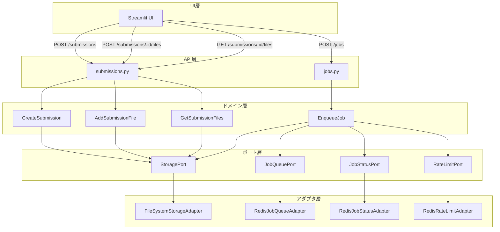
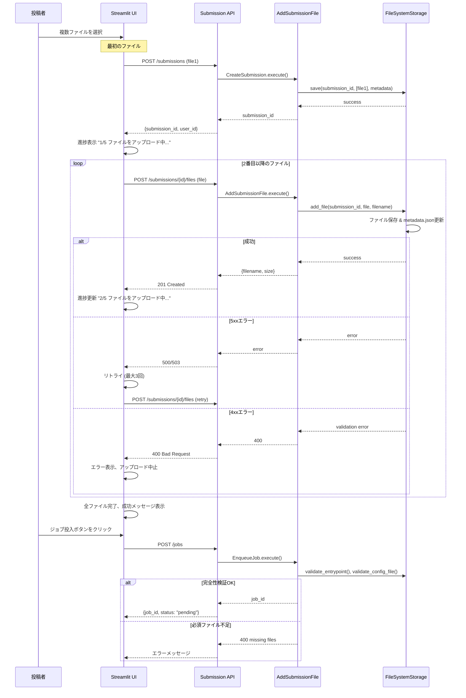

# 技術設計書

## 概要

本機能は、ネットワークの1リクエスト当たり100MB制限に対応するため、ファイルを1つずつ順次アップロードし、全ファイルのアップロード完了後にジョブを投入する仕組みを提供します。既存の一括アップロード方式との後方互換性を維持しながら、新しい順次アップロード方式を追加します。

**目的**: 100MB制限のあるネットワーク環境でも、複数ファイルを含むsubmissionを投稿できるようにする。

**対象ユーザー**: LeadersBoard投稿者（研究者）が、大きなデータセットや複数のモデルファイルをアップロードする際に利用する。

**影響**: 既存の`POST /submissions`エンドポイントは維持され、
新しいエンドポイント`POST /submissions/{submission_id}/files`と
`GET /submissions/{submission_id}/files`が追加される。

### 目標

- 1ファイル1リクエストで順次アップロードできるAPIを提供する
- 全ファイルアップロード完了後にジョブを投入する仕組みを実装する
- 既存の一括アップロード方式との後方互換性を維持する
- Streamlit UIで進捗表示とエラーリトライをサポートする
- ジョブ投入時にsubmissionの完全性を検証する

### 非目標

- ファイルの並列アップロード（順次アップロードのみ）
- アップロード中断後の再開機能（初回リリースでは非対応）
- submissionのTTL管理とガベージコレクション（将来機能）
- 既存の一括アップロードエンドポイントの廃止（互換性維持）

## アーキテクチャ

### 既存アーキテクチャ分析

LeadersBoardは Clean-lite 設計（ポート/アダプタパターン）を採用しており、以下の層構造を持つ：

- **API層**: FastAPI による REST エンドポイント、認証、バリデーション
- **ドメイン層**: ビジネスロジック（ユースケース）
- **ポート層**: 抽象インタフェース（`StoragePort`, `JobQueuePort`, `JobStatusPort`, `RateLimitPort`）
- **アダプタ層**: 具体実装（`FileSystemStorageAdapter`, `RedisJobQueueAdapter` 等）
- **UI層**: Streamlit による Web UI（Thin Client）

既存の`POST /submissions`エンドポイントは複数ファイルを一括受信し、`CreateSubmission`ユースケースで全ファイルを一度に保存する。本機能では、この構造を維持しながら新しいエンドポイントとユースケースを追加する。

### アーキテクチャパターンと境界マップ

**選択パターン**: Clean-lite設計（ポート/アダプタパターン）の拡張

**ドメイン境界**:

- **Submission管理**: ファイルアップロード、メタデータ管理、完全性検証
- **Job管理**: ジョブ投入、状態管理、レート制限（既存）

**既存パターンの保持**:

- ドメイン → ポート（抽象）の依存方向
- アダプタ → ポート実装（ドメインに非依存）
- API/Worker → ドメイン + アダプタ（DI で注入）

**新規コンポーネントの根拠**:

- `AddSubmissionFile`: 単一責任原則（1ファイル追加の専用ユースケース）
- `GetSubmissionFiles`: ファイル一覧取得の専用ユースケース
- `StoragePort`拡張: インタフェース分離原則（add_file, list_files）

**ステアリング準拠**:

- Clean-lite設計の依存逆転原則を維持
- Python 3.13 型ヒント（`mypy` strict mode）
- ポート/アダプタの責任分離



### 技術スタック

| レイヤー         | 選択 / バージョン | 機能における役割                                              | 備考                                 |
| ---------------- | ----------------- | ------------------------------------------------------------- | ------------------------------------ |
| API              | FastAPI 0.109+    | 新規エンドポイント追加、認証、バリデーション                  | 既存のFastAPI環境を拡張              |
| ドメイン         | Python 3.13       | 新規ユースケース追加（AddSubmissionFile, GetSubmissionFiles） | 型ヒント必須（mypy strict）          |
| ストレージ       | FileSystem        | ファイル追加保存、メタデータ更新                              | 既存のFileSystemStorageAdapterを拡張 |
| UI               | Streamlit 1.28+   | 順次アップロードUI、進捗表示、リトライロジック                | 既存のStreamlit UIを拡張             |
| HTTPクライアント | requests 2.31+    | API呼び出し、リトライ機能                                     | Streamlit UIで使用                   |

## システムフロー

### 順次ファイルアップロードフロー



**フロー判断ポイント**:

- 最初のファイルは`POST /submissions`で submission を作成
- 2番目以降のファイルは`POST /submissions/{id}/files`で追加
- 5xxエラー時は最大3回リトライ、4xxエラー時は即座に中止
- 全ファイル完了後、ジョブ投入時に必須ファイル（entrypoint, config_file）の存在を検証

## 要件トレーサビリティ

| 要件    | 概要                         | コンポーネント                | インタフェース                          | フロー           |
| ------- | ---------------------------- | ----------------------------- | --------------------------------------- | ---------------- |
| 1.1-1.8 | ファイル追加API              | AddSubmissionFile, FSAdapter  | POST /submissions/{id}/files            | 順次アップ       |
| 2.1-2.4 | submission初期化             | CreateSubmission (拡張)       | POST /submissions                       | 順次アップ       |
| 3.1-3.6 | UI順次アップ                 | UI (app.py)                   | submit_submission / add_submission_file | 順次アップ       |
| 4.1-4.4 | ジョブ投入遅延               | UI, EnqueueJob                | POST /jobs                              | 順次アップ       |
| 5.1-5.4 | submission完全性検証         | EnqueueJob (拡張)             | EnqueueJob.execute()                    | 順次アップ       |
| 6.1-6.4 | エラーハンドリングとリトライ | UI (app.py)                   | add_submission_file (retry)             | 順次アップ       |
| 7.1-7.4 | 後方互換性                   | 既存コンポ維持                | POST /submissions (既存)                | 一括アップロード |
| 8.1-8.4 | ファイル一覧取得             | GetSubmissionFiles, FSAdapter | GET /submissions/{id}/files             | -                |

## コンポーネントとインタフェース

### コンポーネント概要

| コンポーネント                  | ドメイン/レイヤー | 意図                                   | 要件カバレッジ | 主要依存関係            | 契約           |
| ------------------------------- | ----------------- | -------------------------------------- | -------------- | ----------------------- | -------------- |
| AddSubmissionFile               | ドメイン層        | 既存submissionにファイルを1つ追加      | 1.1-1.8        | StoragePort (P0)        | Service        |
| GetSubmissionFiles              | ドメイン層        | submissionのファイル一覧を取得         | 8.1-8.4        | StoragePort (P0)        | Service        |
| EnqueueJob拡張                  | ドメイン層        | ジョブ投入前の完全性検証               | 5.1-5.4        | StoragePort (P0)        | Service        |
| StoragePort拡張                 | ポート層          | ファイル追加・一覧取得インタフェース   | 1, 8           | -                       | Interface      |
| FileSystemStorageAdapter拡張    | アダプタ層        | ファイル追加・一覧取得の具体実装       | 1, 8           | FileSystem              | Implementation |
| POST /submissions/{id}/files    | API層             | ファイル追加エンドポイント             | 1.1-1.8        | AddSubmissionFile (P0)  | API            |
| GET /submissions/{id}/files     | API層             | ファイル一覧取得エンドポイント         | 8.1-8.4        | GetSubmissionFiles (P0) | API            |
| Streamlit UI (順次アップロード) | UI層              | 順次アップロードUI、進捗表示、リトライ | 3, 4, 6        | Submission API (P0)     | UI             |

### ドメイン層

#### AddSubmissionFile

| 項目 | 詳細                                                          |
| ---- | ------------------------------------------------------------- |
| 意図 | 既存submissionに対して1ファイルを追加し、メタデータを更新する |
| 要件 | 1.1-1.8                                                       |

**責任と制約**

- 既存submissionの存在確認
- ファイルサイズ検証（100MB以下）
- ファイル拡張子検証（`.py`, `.yaml`, `.zip`, `.tar.gz`）
- ファイル名のパストラバーサル検証
- ファイル保存とメタデータ更新（アトミック）

**依存関係**

- Inbound: `POST /submissions/{submission_id}/files` — ファイル追加リクエスト (P0)
- Outbound: StoragePort — ファイル保存とメタデータ更新 (P0)

**契約**: Service [x] / API [ ] / Event [ ] / Batch [ ] / State [ ]

##### Service Interface

```python
class AddSubmissionFile:
    """既存submissionにファイルを追加するユースケース."""

    MAX_FILE_SIZE: int = 100 * 1024 * 1024  # 100MB
    ALLOWED_EXTENSIONS: set[str] = {".py", ".yaml", ".zip", ".tar.gz"}

    def __init__(self, storage: StoragePort) -> None:
        self.storage = storage

    def execute(
        self,
        submission_id: str,
        file: BinaryIO,
        filename: str,
        user_id: str,
    ) -> dict[str, Any]:
        """
        既存submissionにファイルを追加する。

        Args:
            submission_id: 既存のsubmission ID
            file: アップロードするファイル
            filename: ファイル名
            user_id: 認証済みユーザーID

        Returns:
            {"filename": str, "size": int}

        Raises:
            ValueError: submission不存在、ファイル検証失敗、サイズ超過
        """
        ...
```

- **事前条件**: submission_idが存在する、ファイルが有効なBinaryIO
- **事後条件**: ファイルが保存され、metadata.jsonのfilesリストが更新される
- **不変条件**: ファイルサイズ ≤ 100MB、拡張子がホワイトリストに含まれる

**実装ノート**

- **統合**: `POST /submissions/{submission_id}/files`エンドポイントから呼び出される
- **検証**: `_validate_file_size()`, `_validate_extension()`, `_validate_filename()`メソッドを実装
- **リスク**: metadata.json更新時の競合（順次アップロード前提で回避）

#### GetSubmissionFiles

| 項目 | 詳細                                         |
| ---- | -------------------------------------------- |
| 意図 | submissionに含まれるファイルの一覧を取得する |
| 要件 | 8.1-8.4                                      |

**責任と制約**

- submissionの存在確認
- ファイル一覧とメタデータの取得
- ユーザー認証チェック（自身のsubmissionのみアクセス可能）

**依存関係**

- Inbound: `GET /submissions/{submission_id}/files` — ファイル一覧取得リクエスト (P0)
- Outbound: StoragePort — ファイル一覧取得 (P0)

**契約**: Service [x] / API [ ] / Event [ ] / Batch [ ] / State [ ]

##### Service Interface

```python
class GetSubmissionFiles:
    """submissionのファイル一覧を取得するユースケース."""

    def __init__(self, storage: StoragePort) -> None:
        self.storage = storage

    def execute(
        self,
        submission_id: str,
        user_id: str,
    ) -> list[dict[str, Any]]:
        """
        submissionのファイル一覧を取得する。

        Args:
            submission_id: submission ID
            user_id: 認証済みユーザーID

        Returns:
            [{"filename": str, "size": int, "uploaded_at": str}, ...]

        Raises:
            ValueError: submission不存在、権限不足
        """
        ...
```

- **事前条件**: submission_idが存在する、user_idがsubmissionの所有者
- **事後条件**: ファイル一覧が返される
- **不変条件**: 認証済みユーザー自身のsubmissionのみアクセス可能

**実装ノート**

- **統合**: `GET /submissions/{submission_id}/files`エンドポイントから呼び出される
- **検証**: メタデータのuser_idと認証user_idの一致を確認
- **リスク**: なし（読み取り専用操作）

#### EnqueueJob（拡張）

| 項目 | 詳細                                       |
| ---- | ------------------------------------------ |
| 意図 | ジョブ投入前にsubmissionの完全性を検証する |
| 要件 | 5.1-5.4                                    |

**責任と制約**

- submission存在確認（既存）
- entrypointファイルの存在確認（新規）
- config_fileの存在確認（新規）
- レート制限チェック（既存）
- ジョブ投入（既存）

**依存関係**

- Inbound: `POST /jobs` — ジョブ投入リクエスト (P0)
- Outbound: StoragePort — ファイル存在確認 (P0)
- Outbound: JobQueuePort — ジョブ投入 (P0)
- Outbound: JobStatusPort — ステータス作成 (P0)
- Outbound: RateLimitPort — レート制限チェック (P0)

**契約**: Service [x] / API [ ] / Event [ ] / Batch [ ] / State [ ]

##### Service Interface

```python
class EnqueueJob:
    """ジョブ投入ユースケース（完全性検証を追加）."""

    def execute(
        self,
        submission_id: str,
        user_id: str,
        config: dict[str, Any],
    ) -> str:
        """
        ジョブを投入する（完全性検証付き）。

        Args:
            submission_id: submission ID
            user_id: ユーザーID
            config: ジョブ設定

        Returns:
            job_id: 生成されたジョブID

        Raises:
            ValueError:
                - submission不存在
                - 必須ファイル不足（entrypoint or config_file）
                - レート制限超過
                - 同時実行数超過
        """
        # 既存コード
        if not self.storage.exists(submission_id):
            raise ValueError("submission not found")

        metadata = self.storage.load_metadata(submission_id)
        entrypoint = metadata.get("entrypoint", "main.py")
        config_file = metadata.get("config_file", "config.yaml")

        # 新規追加: 完全性検証
        if not self.storage.validate_entrypoint(submission_id, entrypoint):
            raise ValueError(f"entrypoint file not found: {entrypoint}")

        # 新規追加: config_file存在確認
        submission_dir = Path(self.storage.load(submission_id))
        config_path = submission_dir / config_file
        if not config_path.exists():
            raise ValueError(f"config file not found: {config_file}")

        # 既存コード: レート制限、ジョブ投入
        ...
```

- **事前条件**: submission_idが存在する、必須ファイルが存在する
- **事後条件**: ジョブがキューに投入される
- **不変条件**: entrypointとconfig_fileが存在する

**実装ノート**

- **統合**: 既存の`EnqueueJob`クラスに検証ロジックを追加
- **検証**: `storage.validate_entrypoint()`と直接ファイル存在確認を実行
- **リスク**: パフォーマンス（ファイル存在確認のオーバーヘッド）

### ポート層

#### StoragePort（拡張）

| 項目 | 詳細                                             |
| ---- | ------------------------------------------------ |
| 意図 | ファイル追加・一覧取得の抽象インタフェースを定義 |
| 要件 | 1, 8                                             |

**契約**: Service [ ] / API [ ] / Event [ ] / Batch [ ] / State [x]

##### State Management

```python
from abc import ABC, abstractmethod
from typing import BinaryIO, Any

class StoragePort(ABC):
    """ストレージの抽象インタフェース（拡張版）."""

    # 既存メソッド
    @abstractmethod
    def save(self, submission_id: str, files: Iterable[BinaryIO], metadata: dict[str, str]) -> None: ...

    @abstractmethod
    def load(self, submission_id: str) -> str: ...

    @abstractmethod
    def load_metadata(self, submission_id: str) -> dict[str, str]: ...

    @abstractmethod
    def exists(self, submission_id: str) -> bool: ...

    @abstractmethod
    def validate_entrypoint(self, submission_id: str, entrypoint: str) -> bool: ...

    @abstractmethod
    def load_logs(self, job_id: str) -> str: ...

    # 新規追加メソッド
    @abstractmethod
    def add_file(self, submission_id: str, file: BinaryIO, filename: str) -> dict[str, Any]:
        """
        既存submissionにファイルを追加する。

        Args:
            submission_id: submission ID
            file: アップロードするファイル
            filename: ファイル名

        Returns:
            {"filename": str, "size": int}

        Raises:
            ValueError: submission不存在、ファイル名重複
        """
        ...

    @abstractmethod
    def list_files(self, submission_id: str) -> list[dict[str, Any]]:
        """
        submissionのファイル一覧を取得する。

        Args:
            submission_id: submission ID

        Returns:
            [{"filename": str, "size": int, "uploaded_at": str}, ...]

        Raises:
            ValueError: submission不存在
        """
        ...
```

- **状態モデル**: ファイルシステム上のファイルとmetadata.json
- **永続化と一貫性**: ファイル書き込み後にmetadata.json更新（順次処理）
- **並行性戦略**: 順次アップロード（並列なし）

**実装ノート**

- **統合**: 全ストレージアダプタで実装必須
- **検証**: ファイル名重複チェック、submission存在確認
- **リスク**: 将来的なS3アダプタでも対応可能な設計

### アダプタ層

#### FileSystemStorageAdapter（拡張）

| 項目 | 詳細                             |
| ---- | -------------------------------- |
| 意図 | ファイル追加・一覧取得の具体実装 |
| 要件 | 1, 8                             |

**責任と制約**

- ファイルをsubmission_dirに保存
- metadata.jsonのfilesリストを更新（アトミック）
- ファイル一覧取得（metadata.jsonから）
- ファイル名重複チェック

**依存関係**

- Inbound: AddSubmissionFile, GetSubmissionFiles — ファイル追加・一覧取得 (P0)
- Outbound: FileSystem — ファイルIO (P0)

**契約**: Service [ ] / API [ ] / Event [ ] / Batch [ ] / State [x]

##### State Management

```python
from pathlib import Path
from typing import BinaryIO, Any
import json
from datetime import datetime

class FileSystemStorageAdapter(StoragePort):
    """ファイルシステムストレージの実装（拡張版）."""

    # 既存メソッドは省略

    def add_file(self, submission_id: str, file: BinaryIO, filename: str) -> dict[str, Any]:
        """
        既存submissionにファイルを追加する。

        Raises:
            ValueError: submission不存在、ファイル名重複、メタデータが存在しない
        """
        submission_dir = self.submissions_root / submission_id
        if not submission_dir.exists():
            raise ValueError(f"submission not found: {submission_id}")

        # メタデータ読み込み
        metadata_path = submission_dir / "metadata.json"
        if not metadata_path.exists():
            raise ValueError(f"submission {submission_id} metadata not found")
        metadata = json.loads(metadata_path.read_text())

        # ファイル名重複チェック
        if filename in metadata.get("files", []):
            raise ValueError(f"file already exists: {filename}")

        # ファイル保存
        target_path = submission_dir / filename
        file.seek(0)
        content = file.read()
        target_path.write_bytes(content)

        # メタデータ更新（アトミック）
        metadata.setdefault("files", []).append(filename)
        metadata_path.write_text(json.dumps(metadata, ensure_ascii=False))

        return {
            "filename": filename,
            "size": len(content),
        }

    def list_files(self, submission_id: str) -> list[dict[str, Any]]:
        """
        submissionのファイル一覧を取得する。

        Raises:
            ValueError: submission不存在
        """
        submission_dir = self.submissions_root / submission_id
        if not submission_dir.exists():
            raise ValueError(f"submission not found: {submission_id}")

        metadata_path = submission_dir / "metadata.json"
        if not metadata_path.exists():
            raise ValueError(f"metadata not found: {submission_id}")

        metadata = json.loads(metadata_path.read_text())
        files = metadata.get("files", [])

        result = []
        for filename in files:
            file_path = submission_dir / filename
            if file_path.exists():
                stat = file_path.stat()
                result.append({
                    "filename": filename,
                    "size": stat.st_size,
                    "uploaded_at": datetime.fromtimestamp(stat.st_mtime).isoformat(),
                })

        return result
```

- **状態モデル**: ファイルシステム上のファイルとmetadata.json
- **永続化と一貫性**: ファイル書き込み → metadata.json更新（順次）
- **並行性戦略**: 順次アップロード（並列なし）

**実装ノート**

- **統合**: `add_file()`と`list_files()`メソッドを追加
- **検証**: ファイル名重複チェック、metadata.json整合性確認
- **リスク**: metadata.json更新時の例外処理（ファイルは保存済みだが metadata 未更新のケース）

### API層

#### POST /submissions/{submission_id}/files

| 項目 | 詳細                                  |
| ---- | ------------------------------------- |
| 意図 | 既存submissionにファイルを1つ追加する |
| 要件 | 1.1-1.8                               |

**責任と制約**

- 認証トークン検証
- submission_id存在確認
- ファイルバリデーション
- AddSubmissionFile ユースケース呼び出し

**依存関係**

- Inbound: Streamlit UI — ファイル追加リクエスト (P0)
- Outbound: AddSubmissionFile — ファイル追加処理 (P0)
- Outbound: get_current_user — 認証 (P0)

**契約**: Service [ ] / API [x] / Event [ ] / Batch [ ] / State [ ]

##### API Contract

| メソッド | エンドポイント                     | リクエスト                | レスポンス                     | エラー             |
| -------- | ---------------------------------- | ------------------------- | ------------------------------ | ------------------ |
| POST     | /submissions/{submission_id}/files | multipart/form-data: file | {"filename": str, "size": int} | 400, 404, 401, 500 |

**リクエスト例**:

```http
POST /submissions/abc123def456/files HTTP/1.1
Authorization: Bearer token123
Content-Type: multipart/form-data; boundary=----WebKitFormBoundary

------WebKitFormBoundary
Content-Disposition: form-data; name="file"; filename="dataset.zip"
Content-Type: application/zip

<binary data>
------WebKitFormBoundary--
```

**レスポンス例**:

```json
{
  "filename": "dataset.zip",
  "size": 52428800
}
```

**エラーレスポンス**:

- 400: ファイルサイズ超過、拡張子不正、ファイル名重複
- 404: submission_id不存在
- 401: 認証失敗
- 500: サーバーエラー

**実装ノート**

- **統合**: `src/api/submissions.py`に追加
- **検証**: `get_current_user()`依存性注入、`AddSubmissionFile`ユースケース呼び出し
- **リスク**: なし

#### GET /submissions/{submission_id}/files

| 項目 | 詳細                               |
| ---- | ---------------------------------- |
| 意図 | submissionのファイル一覧を取得する |
| 要件 | 8.1-8.4                            |

**責任と制約**

- 認証トークン検証
- submission_id存在確認
- ユーザー権限確認（自身のsubmissionのみ）
- GetSubmissionFiles ユースケース呼び出し

**依存関係**

- Inbound: Streamlit UI — ファイル一覧取得リクエスト (P0)
- Outbound: GetSubmissionFiles — ファイル一覧取得処理 (P0)
- Outbound: get_current_user — 認証 (P0)

**契約**: Service [ ] / API [x] / Event [ ] / Batch [ ] / State [ ]

##### API Contract

| メソッド | エンドポイント                     | リクエスト | レスポンス                                                      | エラー        |
| -------- | ---------------------------------- | ---------- | --------------------------------------------------------------- | ------------- |
| GET      | /submissions/{submission_id}/files | -          | {"files": [{"filename": str, "size": int, "uploaded_at": str}]} | 404, 401, 403 |

**リクエスト例**:

```http
GET /submissions/abc123def456/files HTTP/1.1
Authorization: Bearer token123
```

**レスポンス例**:

```json
{
  "files": [
    {
      "filename": "main.py",
      "size": 2048,
      "uploaded_at": "2025-12-26T10:30:00"
    },
    {
      "filename": "config.yaml",
      "size": 512,
      "uploaded_at": "2025-12-26T10:30:15"
    },
    {
      "filename": "dataset.zip",
      "size": 52428800,
      "uploaded_at": "2025-12-26T10:31:00"
    }
  ]
}
```

**エラーレスポンス**:

- 404: submission_id不存在
- 401: 認証失敗
- 403: 権限不足（他人のsubmission）

**実装ノート**

- **統合**: `src/api/submissions.py`に追加
- **検証**: `get_current_user()`依存性注入、user_id一致確認
- **リスク**: なし

### UI層

#### Streamlit UI（順次アップロード対応）

| 項目 | 詳細                                         |
| ---- | -------------------------------------------- |
| 意図 | 順次アップロードUI、進捗表示、エラーリトライ |
| 要件 | 3, 4, 6                                      |

**責任と制約**

- 複数ファイルの順次アップロード
- 進捗表示（"X/Y ファイルをアップロード中..."）
- 5xxエラー時の自動リトライ（最大3回）
- 4xxエラー時の即座中止
- 全ファイル完了後のジョブ投入ボタン有効化

**依存関係**

- Inbound: ユーザー操作 — ファイル選択、ジョブ投入 (P0)
- Outbound: Submission API — POST /submissions, POST /submissions/:id/files (P0)
- Outbound: Jobs API — POST /jobs (P0)

**契約**: Service [ ] / API [ ] / Event [ ] / Batch [ ] / State [x]

##### State Management

```python
# Streamlit Session State
{
    "submission_id": str | None,  # 現在のsubmission ID
    "uploaded_files": list[str],  # アップロード済みファイル名
    "upload_progress": dict[str, Any],  # 進捗情報
    "upload_complete": bool,  # 全ファイル完了フラグ
}
```

**新規関数**:

```python
def add_submission_file(
    api_url: str,
    token: str,
    submission_id: str,
    file: Any,
    max_retries: int = 3,
) -> dict[str, Any]:
    """
    submissionにファイルを1つ追加する（リトライ付き）。

    Args:
        api_url: API URL
        token: 認証トークン
        submission_id: submission ID
        file: アップロードするファイル
        max_retries: 最大リトライ回数

    Returns:
        {"filename": str, "size": int}

    Raises:
        requests.HTTPError: 4xxエラー（リトライなし）
        Exception: リトライ3回失敗後
    """
    url = f"{api_url.rstrip('/')}/submissions/{submission_id}/files"
    headers = {"Authorization": f"Bearer {token}"}

    for attempt in range(max_retries):
        try:
            files_payload = {"file": (file.name, file, file.type)}
            response = requests.post(url, headers=headers, files=files_payload, timeout=30)
            response.raise_for_status()
            return response.json()
        except requests.HTTPError as exc:
            if 400 <= exc.response.status_code < 500:
                # 4xxエラー: リトライしない
                raise
            if attempt < max_retries - 1:
                # 5xxエラー: リトライ
                time.sleep(2 ** attempt)  # Exponential backoff
                continue
            raise

    raise Exception("Max retries exceeded")


def submit_files_sequentially(
    api_url: str,
    token: str,
    files: list[Any],
    entrypoint: str,
    config_file: str,
    metadata: dict[str, Any],
) -> str:
    """
    ファイルを順次アップロードする。

    Returns:
        submission_id: 作成されたsubmission ID

    Raises:
        Exception: アップロード失敗
    """
    if not files:
        raise ValueError("No files to upload")

    # 最初のファイルでsubmission作成
    first_file = files[0]
    files_payload = [(first_file.name, first_file, first_file.type)]
    submission = submit_submission(
        api_url=api_url,
        token=token,
        files=files_payload,
        entrypoint=entrypoint,
        config_file=config_file,
        metadata=metadata,
    )
    submission_id = submission["submission_id"]

    # 進捗表示
    progress_placeholder = st.empty()
    progress_placeholder.info(f"1/{len(files)} ファイルをアップロード中...")

    # 2番目以降のファイルを順次アップロード
    for i, file in enumerate(files[1:], start=2):
        try:
            progress_placeholder.info(f"{i}/{len(files)} ファイルをアップロード中...")
            add_submission_file(api_url, token, submission_id, file)
        except requests.HTTPError as exc:
            st.error(f"ファイルアップロード失敗: {file.name} - {exc}")
            raise
        except Exception as exc:
            st.error(f"ファイルアップロードエラー: {file.name} - {exc}")
            raise

    progress_placeholder.success(f"全ファイル（{len(files)}件）のアップロードが完了しました。")
    return submission_id
```

**UIフロー修正**:

```python
def _render_submission_form(api_url: str, mlflow_url: str) -> None:
    st.header("Submission")
    token = st.text_input("API Token", type="password", key="token_input")
    uploaded_files = st.file_uploader("Upload files", accept_multiple_files=True)
    entrypoint = st.text_input("Entrypoint", value="main.py")
    config_file = st.text_input("Config file", value="config.yaml")
    metadata_text = st.text_area("metadata (JSON)", value='{"method":"padim"}')

    # ジョブ投入ボタンの無効化制御
    upload_complete = st.session_state.get("upload_complete", False)

    if st.button("Submit", type="primary", disabled=st.session_state.get("uploading", False)):
        if not token:
            st.error("API Tokenを入力してください。")
            return
        if not uploaded_files:
            st.error("少なくとも1つのファイルをアップロードしてください。")
            return

        try:
            metadata = json.loads(metadata_text) if metadata_text.strip() else {}
        except json.JSONDecodeError:
            st.error("metadata は JSON 形式で入力してください。")
            return

        # アップロード中フラグを設定
        st.session_state["uploading"] = True
        st.session_state["upload_complete"] = False

        try:
            # 順次アップロード実行
            submission_id = submit_files_sequentially(
                api_url=api_url,
                token=token,
                files=uploaded_files,
                entrypoint=entrypoint,
                config_file=config_file,
                metadata=metadata,
            )
            st.session_state["submission_id"] = submission_id
            st.session_state["upload_complete"] = True
            st.success(f"Submission created: {submission_id}")
        except Exception as exc:
            st.error(f"Submission failed: {exc}")
            return
        finally:
            st.session_state["uploading"] = False

    # ジョブ投入ボタン
    if upload_complete and st.button("Enqueue Job", type="secondary"):
        submission_id = st.session_state.get("submission_id")
        if not submission_id:
            st.error("submission_idが見つかりません。")
            return

        try:
            job_resp = create_job(
                api_url=api_url,
                token=token,
                submission_id=submission_id,
                config={"resource_class": "medium"},
            )
            job_info = {
                "job_id": job_resp.get("job_id"),
                "submission_id": submission_id,
                "status": job_resp.get("status", "pending"),
                "mlflow_url": mlflow_url,
            }
            add_job_to_state(st.session_state, job_info)
            st.success(f"Job enqueued: {job_info['job_id']}")
            st.session_state["upload_complete"] = False  # リセット
        except Exception as exc:
            st.error(f"Job enqueue failed: {exc}")
```

- **状態モデル**: Streamlit Session State で進捗管理
- **永続化と一貫性**: なし（セッションスコープ）
- **並行性戦略**: 順次アップロード（並列なし）

**実装ノート**

- **統合**: `src/streamlit/app.py`を修正
- **検証**: ファイル選択数、進捗表示、エラーハンドリング
- **リスク**: ページリフレッシュ時のセッション状態リセット

## データモデル

### ドメインモデル

**エンティティ**:

- **Submission**: ファイルとメタデータの集合
  - submission_id: 一意識別子
  - user_id: 所有者
  - files: ファイル名のリスト
  - entrypoint: エントリポイントファイル名
  - config_file: 設定ファイル名
  - metadata: 追加メタデータ

**値オブジェクト**:

- **FileInfo**: ファイル情報
  - filename: ファイル名
  - size: ファイルサイズ（バイト）
  - uploaded_at: アップロード日時

**ビジネスルール**:

- ファイルサイズは100MB以下
- 拡張子は`.py`, `.yaml`, `.zip`, `.tar.gz`のみ
- ファイル名にパストラバーサルは不可
- ジョブ投入時にentrypointとconfig_fileが存在必須

### 論理データモデル

**構造定義**:

- Submission ディレクトリ: `/shared/submissions/{submission_id}/`
- metadata.json: submissionメタデータ
- ファイル: submission ディレクトリ直下

**属性と型**:

- submission_id: `str`（UUID hex）
- user_id: `str`（認証トークン）
- files: `list[str]`（ファイル名リスト）
- entrypoint: `str`（デフォルト: `main.py`）
- config_file: `str`（デフォルト: `config.yaml`）

**整合性ルール**:

- files リストとディレクトリ内ファイルの一致
- metadata.json の存在必須

### 物理データモデル（ファイルシステム）

**ディレクトリ構造**:

```text
/shared/submissions/{submission_id}/
├── metadata.json
├── main.py
├── config.yaml
└── dataset.zip
```

**metadata.json フォーマット**:

```json
{
  "user_id": "token123",
  "entrypoint": "main.py",
  "config_file": "config.yaml",
  "files": ["main.py", "config.yaml", "dataset.zip"],
  "method": "padim"
}
```

**更新戦略**:

- ファイル追加時: files リストに追加（append）
- アトミック書き込み: ファイル保存 → metadata.json 更新

## エラーハンドリング

### エラー戦略

本機能では、以下のエラーカテゴリに対して具体的な回復メカニズムを実装する：

**ユーザーエラー（4xx）**:

- ファイルサイズ超過 → エラーメッセージ表示、アップロード中止
- 拡張子不正 → エラーメッセージ表示、アップロード中止
- ファイル名重複 → エラーメッセージ表示、アップロード中止
- submission不存在 → 404エラー、新規作成を促す

**システムエラー（5xx）**:

- API一時障害 → 自動リトライ（最大3回、Exponential backoff）
- ストレージ障害 → エラーメッセージ表示、管理者に通知

**ビジネスロジックエラー（422）**:

- 必須ファイル不足 → エラーメッセージに不足ファイル名を表示
- レート制限超過 → エラーメッセージ表示、待機時間を案内

### エラーカテゴリとレスポンス

| エラーカテゴリ     | HTTPステータス | 原因                  | クライアント側対応 | サーバー側対応     |
| ------------------ | -------------- | --------------------- | ------------------ | ------------------ |
| ファイルサイズ超過 | 400            | ファイル > 100MB      | エラー表示、中止   | バリデーション拒否 |
| 拡張子不正         | 400            | 許可リスト外          | エラー表示、中止   | バリデーション拒否 |
| ファイル名重複     | 400            | 同名ファイル存在      | エラー表示、中止   | 重複チェック拒否   |
| submission不存在   | 404            | ID不存在              | 新規作成を促す     | 存在確認           |
| 認証失敗           | 401            | トークン不正          | ログイン促す       | トークン検証       |
| 権限不足           | 403            | 他人のsubmission      | エラー表示         | user_id確認        |
| API一時障害        | 500/503        | サーバーエラー        | 自動リトライ       | ログ記録、アラート |
| 必須ファイル不足   | 400            | entrypoint/config不在 | 不足ファイル名表示 | 完全性検証         |

### モニタリング

**ログ記録**:

- ファイルアップロード成功/失敗
- リトライ回数と結果
- ジョブ投入時の検証結果

**メトリクス**:

- アップロード成功率
- 平均リトライ回数
- ファイルサイズ分布

**アラート**:

- 5xxエラー率が10%超過
- リトライ失敗率が20%超過

## テスト戦略

### ユニットテスト

**ドメイン層**:

- `AddSubmissionFile.execute()`: ファイル追加成功、サイズ超過、拡張子不正、重複
- `GetSubmissionFiles.execute()`: ファイル一覧取得成功、submission不存在、権限不足
- `EnqueueJob.execute()`: 完全性検証成功、entrypoint不在、config_file不在

**アダプタ層**:

- `FileSystemStorageAdapter.add_file()`: ファイル保存とmetadata更新、重複チェック
- `FileSystemStorageAdapter.list_files()`: ファイル一覧取得、metadata読み込み

**API層**:

- `POST /submissions/{id}/files`: 認証、バリデーション、ユースケース呼び出し
- `GET /submissions/{id}/files`: 認証、権限確認、ユースケース呼び出し

### 統合テスト

**エンドツーエンドフロー**:

1. 最初のファイルでsubmission作成 → submission_id取得
2. 2番目のファイルを追加 → ファイル追加成功
3. 3番目のファイルを追加 → ファイル追加成功
4. ファイル一覧取得 → 3ファイル確認
5. ジョブ投入 → 完全性検証成功、job_id取得

**エラーシナリオ**:

- ファイルサイズ超過 → 400エラー
- submission不存在 → 404エラー
- 必須ファイル不足 → ジョブ投入時400エラー

**リトライテスト**:

- 5xxエラー発生 → 自動リトライ → 成功
- 5xxエラー3回連続 → リトライ失敗

### UI テスト

**Streamlit UI**:

- 複数ファイル選択 → 順次アップロード → 進捗表示確認
- アップロード失敗 → エラーメッセージ表示
- 全ファイル完了 → ジョブ投入ボタン有効化
- ジョブ投入 → job_id表示

### パフォーマンステスト

**負荷シナリオ**:

- 100ファイルの順次アップロード → 完了時間測定
- 並行アップロード（5ユーザー） → スループット測定
- 大きなファイル（95MB） → アップロード時間測定

**目標値**:

- 1ファイルアップロード: < 10秒（100MB）
- 10ファイル順次アップロード: < 2分
- 並行アップロード（5ユーザー）: スループット > 5 files/sec

## オプションセクション

### セキュリティ考慮事項

**脅威モデル**:

- ファイル名のパストラバーサル → バリデーションで拒否
- 大きなファイルのDoS → サイズ制限（100MB）
- 他人のsubmissionへのアクセス → user_id確認

**認証と認可**:

- `Authorization: Bearer <token>` による認証（既存）
- user_id確認による認可（submission所有者のみ）

**データ保護**:

- ファイルは`/shared/submissions`に保存（コンテナ内）
- metadata.jsonにuser_idを記録（追跡可能）

### パフォーマンスとスケーラビリティ

**目標メトリクス**:

- 1ファイルアップロード: < 10秒（100MB）
- ファイル一覧取得: < 1秒
- ジョブ投入（検証含む）: < 3秒

**スケーリング戦略**:

- 水平スケーリング: 複数APIインスタンス（共有ストレージ必要）
- ストレージスケーリング: ファイルシステム → S3移行（将来）

**キャッシング**:

- metadata.json のメモリキャッシュ（将来）
- ファイル一覧のキャッシュ（TTL: 60秒）

### 移行戦略

本機能は既存システムへの拡張であり、データ移行は不要。

**段階的ロールアウト**:

1. **Phase 1**: API層実装（新規エンドポイント追加）
2. **Phase 2**: ドメイン層・アダプタ層実装
3. **Phase 3**: Streamlit UI実装
4. **Phase 4**: 統合テスト・本番デプロイ

**ロールバック条件**:

- 統合テスト失敗率 > 10%
- 本番エラー率 > 5%

**検証チェックポイント**:

- Phase 1: API エンドポイント動作確認
- Phase 2: ファイル追加・一覧取得動作確認
- Phase 3: UI での順次アップロード動作確認
- Phase 4: E2E フロー動作確認

## 参照資料

- [FastAPI File Uploads](https://fastapi.tiangolo.com/tutorial/request-files/) — マルチパートファイルアップロードの公式ドキュメント
- [Streamlit File Uploader](https://docs.streamlit.io/library/api-reference/widgets/st.file_uploader) — Streamlit のファイルアップロードウィジェット
- [Python Type Hints](https://docs.python.org/3/library/typing.html) — 型安全性のための Python 公式ドキュメント
- [Clean Architecture](https://blog.cleancoder.com/uncle-bob/2012/08/13/the-clean-architecture.html) — Robert C. Martin によるクリーンアーキテクチャの原則
- `.kiro/specs/sequential-file-upload/research.md` — 本機能の詳細な調査記録
