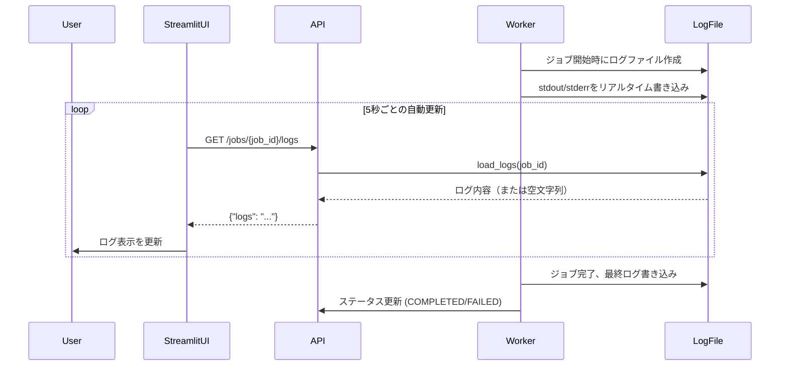

# Technical Design Document

## Overview

**Purpose**: この機能は、Streamlit UI上でworkerプロセスのログをリアルタイムに表示することで、研究者がジョブ実行中の進捗を詳細に監視できるようにする。

**Users**: 研究者はジョブ実行中のログを確認し、学習の進捗やエラーを即座に把握できる。管理者は複数ジョブの状態をリアルタイムに監視できる。

**Impact**: 現在の「完了後にのみログ表示」から「実行中にリアルタイムでログ表示」へ変更。Worker、API、Streamlit UIの3コンポーネントを修正。

### Goals

- 実行中のジョブのログをリアルタイムで共有ストレージに出力する
- Streamlit UIで実行中ジョブのログを5秒ごとに自動更新表示する
- APIで実行中ジョブのログを取得可能にする（404ではなく空文字列を返す）

### Non-Goals

- WebSocketやServer-Sent Eventsによるプッシュ通知（既存のポーリングパターンを維持）
- ログの永続化ポリシー変更（既存の90日TTLを継続）
- ログのフィルタリング・検索機能

## Architecture

### Existing Architecture Analysis

現在のシステムは以下のパターンを使用:

- **Clean-lite設計**: ポート/アダプタパターンで依存逆転
- **ファイルベースログ**: `/shared/logs/{job_id}.log`に保存
- **REST API**: FastAPIエンドポイント経由でログ取得
- **Thin Client**: Streamlit UIはREST API呼び出しのみ

**現在の問題点**:

1. Workerは`subprocess.run()`で実行し、完了後にのみログをコピー
2. Streamlit UIは`completed`/`failed`のジョブのみログ表示
3. APIは存在しないログファイルに対して例外送出

### Architecture Pattern & Boundary Map

```mermaid
graph TB
    subgraph Streamlit
        UI[Streamlit UI]
        LogDisplay[Log Display Component]
    end

    subgraph API
        JobsEndpoint[GET /jobs/job_id/logs]
    end

    subgraph Worker
        JobWorker[JobWorker]
        SubProcess[subprocess.Popen]
    end

    subgraph SharedStorage
        LogFile[/shared/logs/job_id.log]
    end

    UI --> LogDisplay
    LogDisplay -->|fetch every 5s| JobsEndpoint
    JobsEndpoint -->|load_logs| LogFile
    JobWorker --> SubProcess
    SubProcess -->|stdout/stderr| LogFile
```

**Architecture Integration**:

- **Selected pattern**: 既存のファイルベースアーキテクチャを拡張
- **Domain/feature boundaries**: Worker（ログ生成）、API（ログ提供）、UI（ログ表示）の責務分離を維持
- **Existing patterns preserved**: Clean-lite設計、REST API、st.fragment自動更新
- **New components rationale**: 新規コンポーネントなし、既存コンポーネントの拡張のみ
- **Steering compliance**: 依存逆転、Thin Clientパターンを維持

### Technology Stack

| Layer | Choice / Version | Role in Feature | Notes |
|-------|------------------|-----------------|-------|
| Worker | Python 3.13 subprocess.Popen | リアルタイムログストリーミング | run()からPopen()へ変更 |
| API | FastAPI + FileSystemStorageAdapter | ログ取得エンドポイント | エラーハンドリング追加 |
| UI | Streamlit 1.37+ st.fragment | リアルタイムログ表示 | 既存の自動更新パターン活用 |
| Storage | 共有ファイルシステム /shared/logs/ | ログファイル保存 | 既存構成を維持 |

## System Flows

### リアルタイムログ表示フロー



**Key Decisions**:

- ジョブ開始時にログファイルを作成し、実行前から取得可能にする
- 自動更新はジョブが`pending`/`running`の間のみ実行
- ジョブ完了後は自動更新を停止し、最終ログを表示

## Requirements Traceability

| Requirement | Summary | Components | Interfaces | Flows |
|-------------|---------|------------|------------|-------|
| 1.1, 1.2, 1.3 | ログ表示フィールド表示 | StreamlitLogDisplay | - | - |
| 1.4, 1.5 | スクロール・空ログ表示 | StreamlitLogDisplay | - | - |
| 2.1, 2.2, 2.3 | リアルタイムログ出力 | JobWorker | - | ログ出力フロー |
| 2.4, 2.5 | エラー処理・排他制御 | JobWorker | - | - |
| 3.1, 3.2, 3.3 | API実行中ログ取得 | JobsLogsEndpoint | StoragePort.load_logs | - |
| 3.4, 3.5 | APIエラー処理 | JobsLogsEndpoint | - | - |
| 4.1, 4.2, 4.3 | 自動更新表示 | StreamlitLogDisplay | fetch_job_logs | 自動更新フロー |
| 4.4, 4.5 | 更新失敗時処理 | StreamlitLogDisplay | - | - |
| 5.1-5.5 | UI/UX改善 | StreamlitLogDisplay | - | - |
| 6.1-6.5 | パフォーマンス | JobsLogsEndpoint, StreamlitLogDisplay | - | - |
| 7.1-7.5 | セキュリティ | JobsLogsEndpoint | - | - |

## Components and Interfaces

| Component | Domain/Layer | Intent | Req Coverage | Key Dependencies | Contracts |
|-----------|--------------|--------|--------------|------------------|-----------|
| JobWorker | Worker層 | リアルタイムログ出力 | 2.1-2.5 | StoragePort (P0) | - |
| JobsLogsEndpoint | API層 | ログ取得API | 3.1-3.5, 6.5, 7.1-7.5 | StoragePort (P0) | API |
| StreamlitLogDisplay | UI層 | ログ表示UI | 1.1-1.5, 4.1-4.5, 5.1-5.5, 6.3-6.4 | API (P0) | - |
| FileSystemStorageAdapter | アダプタ層 | ログファイル読み取り | 3.3, 6.5 | ファイルシステム (P0) | Service |

### Worker層

#### JobWorker（拡張）

| Field | Detail |
|-------|--------|
| Intent | ジョブ実行時にstdout/stderrをリアルタイムでログファイルに出力 |
| Requirements | 2.1, 2.2, 2.3, 2.4, 2.5 |

**Responsibilities & Constraints**

- `subprocess.Popen`を使用してサブプロセスを起動
- stdout/stderrをログファイルに直接ストリーミング
- ジョブ開始時にログファイルを作成（APIからの早期アクセスを可能に）
- タイムアウト・異常終了時もログを保持

**Dependencies**

- Outbound: StoragePort — logs_root取得 (P0)
- External: subprocess.Popen — サブプロセス実行 (P0)

**Contracts**: Service [x]

##### Service Interface

```python
class JobWorker:
    def execute_job(self, job: dict[str, Any]) -> str | None:
        """ジョブを実行し、run_idを返す。
        
        変更点:
        - subprocess.run() → subprocess.Popen() に変更
        - ジョブ開始時にログファイルを作成
        - stdout/stderrをログファイルに直接書き込み
        """
        ...

    def _execute_subprocess(
        self,
        command: list[str],
        log_path: Path,
        timeout_seconds: float | None,
    ) -> None:
        """サブプロセスを実行し、出力をログファイルにストリーミング。
        
        Args:
            command: 実行するコマンド
            log_path: ログ出力先ファイルパス
            timeout_seconds: タイムアウト秒数（Noneで無制限）
        
        Raises:
            subprocess.TimeoutExpired: タイムアウト時
            subprocess.CalledProcessError: 非ゼロ終了コード時
        """
        ...
```

- Preconditions: job_idが有効、ログディレクトリが存在
- Postconditions: ログファイルにstdout/stderrが書き込まれている
- Invariants: ログファイルは実行開始から完了まで存在

**Implementation Notes**

- Integration: `subprocess.Popen(stdout=log_file, stderr=subprocess.STDOUT)`でストリーミング
- Validation: タイムアウト処理は`process.wait(timeout=...)`で実装
- Risks: サブプロセスの出力バッファリングにより遅延の可能性（`PYTHONUNBUFFERED=1`で緩和）

### API層

#### JobsLogsEndpoint（拡張）

| Field | Detail |
|-------|--------|
| Intent | 実行中ジョブのログも取得可能にするAPIエンドポイント |
| Requirements | 3.1, 3.2, 3.3, 3.4, 3.5, 6.5, 7.1, 7.2, 7.3, 7.4, 7.5 |

**Responsibilities & Constraints**

- ログファイルが存在しない場合は空文字列を返す（404ではなく）
- 大きなログファイルは最後の1000行のみ返す
- 認証トークン検証を維持

**Dependencies**

- Inbound: StreamlitUI — ログ取得リクエスト (P0)
- Outbound: StoragePort — load_logs呼び出し (P0)

**Contracts**: API [x]

##### API Contract

| Method | Endpoint | Request | Response | Errors |
|--------|----------|---------|----------|--------|
| GET | /jobs/{job_id}/logs | - | `{"job_id": str, "logs": str}` | 401 (認証失敗) |

**レスポンス仕様変更**:

- ログファイルが存在しない場合: `{"job_id": "...", "logs": ""}`（以前: 500エラー）
- ログファイルが1000行超: 最後の1000行のみ返却

**Implementation Notes**

- Integration: `try-except FileNotFoundError`でエラーハンドリング
- Validation: 認証は既存の`get_current_user`依存性を維持
- Risks: 大きなファイルのtail処理でI/O負荷

### UI層

#### StreamlitLogDisplay（新規追加）

| Field | Detail |
|-------|--------|
| Intent | 実行中・完了ジョブのログを表示するUIコンポーネント |
| Requirements | 1.1, 1.2, 1.3, 1.4, 1.5, 4.1, 4.2, 4.3, 4.4, 4.5, 5.1, 5.2, 5.3, 5.4, 5.5, 6.3, 6.4 |

**Responsibilities & Constraints**

- 実行中ジョブ: ログ表示フィールドを展開状態で表示、5秒ごとに自動更新
- 完了ジョブ: Expander内に折りたたみ表示
- 手動更新ボタンを提供
- 等幅フォントでログを表示

**Dependencies**

- Outbound: API — fetch_job_logs (P0)
- External: Streamlit st.fragment — 自動更新 (P0)

**Contracts**: State [x]

##### State Management

- State model: `st.session_state.jobs` にジョブ一覧とログキャッシュを保持
- Persistence: Streamlitセッション内のみ（ブラウザリロードでリセット）
- Concurrency: ユーザーごとに独立したセッション

**Implementation Notes**

- Integration: 既存の`_render_jobs`フラグメント内に追加
- Validation: トークン・job_idの存在チェック
- Risks: 頻繁な再描画によるちらつき（`st.fragment`で緩和済み）

### アダプタ層

#### FileSystemStorageAdapter（拡張）

| Field | Detail |
|-------|--------|
| Intent | ログファイルの読み取り（tail対応） |
| Requirements | 3.3, 6.5 |

**Responsibilities & Constraints**

- 既存の`load_logs()`インターフェースを維持
- オプションでtail行数を指定可能に

**Dependencies**

- External: ファイルシステム — ログファイル読み取り (P0)

**Contracts**: Service [x]

##### Service Interface

```python
class FileSystemStorageAdapter(StoragePort):
    def load_logs(self, job_id: str, tail_lines: int | None = None) -> str:
        """ジョブのログを読み取る。
        
        Args:
            job_id: ジョブID
            tail_lines: 取得する最終行数（Noneで全行）
        
        Returns:
            ログ内容（ファイルが存在しない場合は空文字列ではなくFileNotFoundError）
        
        Note:
            tail_linesが指定された場合、ファイルの最後のN行のみを返す。
            これにより大きなログファイルのメモリ使用量を抑制する。
        """
        ...
```

**Implementation Notes**

- Integration: `collections.deque(maxlen=tail_lines)`でtail処理
- Validation: tail_linesは正の整数のみ
- Risks: 大きなファイルの読み取りでI/O負荷（tail処理で緩和）

## Data Models

### Domain Model

本機能では新規エンティティは追加しない。既存の`JobStatus`モデルを使用。

### Logical Data Model

**ログファイル構造** (`/shared/logs/{job_id}.log`):

- 形式: テキストファイル（UTF-8）
- 内容: サブプロセスのstdout/stderr混合出力
- 更新: リアルタイム追記
- 保持期間: ジョブと同じ90日

## Error Handling

### Error Strategy

| エラーカテゴリ | 発生箇所 | 対応 |
|---------------|---------|------|
| ログファイル未存在 | API | 空文字列を返却（ジョブ開始直後の正常状態） |
| ログファイル読み取りエラー | API | 500エラー + ログ記録 |
| API接続失敗 | Streamlit UI | 最後に取得したログを保持 + エラー表示 |
| タイムアウト | Worker | ログに「timeout」を追記 + FAILED状態更新 |
| サブプロセス異常終了 | Worker | stderrをログに出力 + FAILED状態更新 |

### Monitoring

- Worker: ログファイル書き込み失敗をワーカーログに記録
- API: ログ取得エラーをFastAPIログに記録
- Streamlit: コンソールにエラーログ出力（st.errorでユーザー通知）

## Testing Strategy

### Unit Tests

- `test_job_worker_realtime_logging`: Popenでログがリアルタイム出力されることを検証
- `test_job_worker_timeout_handling`: タイムアウト時のログ保持を検証
- `test_api_logs_empty_on_missing_file`: ファイル未存在時に空文字列を返すことを検証
- `test_api_logs_tail_large_file`: 大きなファイルのtail処理を検証
- `test_streamlit_log_display_running_job`: 実行中ジョブのログ表示を検証

### Integration Tests

- `test_e2e_realtime_log_visibility`: ジョブ実行中にAPIでログが取得可能であることを検証
- `test_e2e_log_update_during_execution`: 実行中にログが更新されることを検証
- `test_e2e_streamlit_auto_refresh_logs`: UI自動更新でログが更新されることを検証

### E2E/UI Tests

- 実行中ジョブでログ表示フィールドが表示されることを確認
- 5秒ごとにログが更新されることを確認
- 手動更新ボタンが機能することを確認

## Security Considerations

### 既存のセキュリティ対策を維持

- Bearer トークン認証: すべてのAPIアクセスに必須（要件7.1, 7.2）
- ジョブ所有者検証: 将来の拡張として考慮（要件7.3）
- トークンの安全な管理: Streamlit session_stateで保持（要件7.4）

### 本機能固有の考慮事項

- ログ内容のフィルタリング（要件7.5）: 現時点では未実装、将来の拡張として検討
- パストラバーサル防止: job_idはUUID形式のみ許可（既存の検証を維持）

## Performance & Scalability

### Target Metrics

- ログ取得レイテンシ: < 500ms（1000行以下のログ）
- 自動更新間隔: 5秒（既存と同じ）
- 同時ログ閲覧ユーザー: 10ユーザーまでスムーズに動作

### Optimization Techniques

- tail処理: 大きなログファイルは最後の1000行のみ取得（要件3.3, 6.5）
- フラグメント更新: `st.fragment`で部分更新のみ（要件6.4）
- 条件付きAPI呼び出し: 実行中ジョブがある場合のみログ取得（パフォーマンス最適化）
